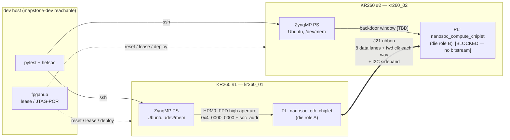

# Architecture — DUT and bench

The thing under test and the machinery that pokes it. Read this before
[`VERIFICATION_PLAN.md`](VERIFICATION_PLAN.md) or [`TEST_MATRIX.md`](TEST_MATRIX.md);
both assume the vocabulary and the address facts below.

**Confidence tags used throughout:**
`[PROVEN]` observed on real silicon, cited · `[PROVEN-SIM]` passes in a committed
cocotb/VCS env · `[DERIVED]` computed from RTL that is in the tree but never
executed at that address · `[TBD]` not established anywhere — the source is named
· `[BLOCKED]` cannot exist until a named gap closes.

---

## 1. Topology — the heterogeneous pair

Two KR260 boards, one chiplet design each, joined at J21 by a straight-through
RPi-40 ribbon carrying the TideLink D2D pins.



### Board / role assignment

| | Board A | Board B |
|---|---|---|
| Design | `nanosoc_eth_chiplet` | `nanosoc_compute_chiplet` |
| fpgahub name | `kr260_01` | `kr260_02` |
| Host (today's eth pair) | `ubuntu@10.22.24.159` | `ubuntu@10.22.24.153` |
| TideLink role | **master** — `ROLE_CFG=0x02` | **slave** — `ROLE_CFG=0x03` |
| TideChart root (recommended) | leaf | **root** |
| PTP grandmaster | **GM** (only die with a real time source) | subordinate `[BLOCKED]` |
| Bitstream today | `kr260-eth-chiplet` / `-flip` `[PROVEN]` | **none** `[BLOCKED]` |

> **Three different "masters" — do not conflate them.**
> 1. **TideLink role** (`ROLE_CFG` bit[0], link layer) — decides which end drives
>    link training. Pinned by strap, *not* elected. `role_status[0]` is
>    **inverted**: `0 = master` (`docs/STATUS_REGISTERS.md:27,257-259` in the eth
>    repo).
> 2. **TideChart root** (fabric identity/enumeration) — elected from
>    `{device_class, random_id}`, lowest wins. Independent of #1.
> 3. **PTP grandmaster** (time) — whoever holds the disciplined clock.
>
> The eth chiplet is the natural TideLink master (its bitstream and the `die_a`
> strap are the proven ones) and the natural PTP GM (it is the only die with an
> Ethernet MAC + HA1588). The compute chiplet is the natural TideChart root
> ("the host-CPU chiplet, lowest class" — `NanoSoC-Compute-Chiplet/docs/STATUS.md:85-87`).

### Cabling rules (inherited, non-negotiable)

From `nanosoc-ethernet-chiplet/docs/KR260_BENCH_RUNBOOK.md:33-41`:

- Ribbon J21↔J21 **straight-through** (`BCM_n ↔ BCM_n`).
- **Strip the +3V3 (pins 1,17) and +5V (pins 2,4) conductors** — a full ribbon
  back-feeds the regulators.
- Never load the same image on both boards: two drivers on every ribbon lane.
- SWD probes optional (PMOD2 pins 1-3); PS-side bring-up needs none `[PROVEN]`.

---

## 2. Inside each chiplet

### 2.1 Eth chiplet — `nanosoc_eth_chiplet.sv`

Wraps `nanosoc_multicore_soc` (dual Cortex-M0+) + `chiplet_d2d_decode` + **one**
`tidelink_top` + `tidechart_shim(NUM_PORTS=1)`.

| Region | Base | What |
|---|---|---|
| `eth_ss_slave` | `0x0000_0000` | CPU0 (network_core) admin window: bootrom / IMEM / DMEM |
| `dmac_0` | `0x2000_0000` | DMA APB cfg (PL230-compatible register map) |
| `qspi_flash_0` | `0x2100_0000` | QSPI controller APB |
| `phc_0` | `0x2200_0000` | PTP hardware clock |
| **`ipc_mailbox_0`** | **`0x2300_0000`** | IPC mailbox — **inbound D2D target #2** |
| `qspi_flash_xip` | `0x2400_0000` | 64 MB XiP read aperture |
| `cc_periph_0` | `0x2800_0000` | CPU1 CMSDK peripherals |
| `chip_core_remap_0` | `0x2900_0000` | CPU1 remap ctrl |
| `reset_ctrl_0` | `0x2A00_0000` | per-core reset controller |
| `evt_route_0` | `0x2B00_0000` | event routing |
| `ctrl_dbg_group` | `0x2C00_0000` | ETC / spinlock / perf probe / bus fault mon |
| **`shared_sram_0`** | **`0x2D00_0000`** | shared SRAM — **inbound D2D target #1** |
| `d2d` | `0x2E00_0000` (32 MB) | passthrough to `d2d_ahb_m` → the chiplet wrapper |
| `cpu_ss_1_slave` | `0x8000_0000` | CPU1 admin window |
| `network_core_dbg_window` | `0xA000_0000` | CPU0 PPB (DAP-only) |
| `chip_core_dbg_window` | `0xB000_0000` | CPU1 PPB (DAP-only) |

Source: `nanosoc-ethernet-chiplet/nanosoc-multicore-system/sys_desc/nanosoc_multicore_soc.yaml:2163-2205`.
Ethernet MAC + HA1588 sit at `0x4000_0000` in CPU0's *local* view, scratch RX/TX
at `0x3000_0000`/`0x3800_0000`
(`nanosoc-multicore-system/firmware/include/nanosoc_multicore_addrmap.h:46-48,86`).

### 2.2 Compute chiplet — `nanosoc_compute_chiplet.sv`

Wraps `nanosoc_compute_soc` (**Cortex-M0+ manager** + **Cortex-M4 compute**, the
M0+ PRMU is the SoC clock/reset master) + `chiplet_d2d_decode` + **two**
`tidelink_top` + `tidechart_shim(NUM_PORTS=2)`. No Ethernet MAC, no accelerators
(`ACCEL_COUNT=0`, `SRAM_BLOCK_COUNT=0`).

| Region | Base | What |
|---|---|---|
| **`ipc_mailbox_0`** | **`0x2A00_0000`** | IPC mailbox — **inbound D2D target #2** |
| **`shared_sram_0`** | **`0x2D00_0000`** | shared SRAM — **inbound D2D target #1** |
| `mgr_remap_0` | **`0x2E00_0000`** | manager remap register ⚠ **collides with the eth D2D window** |
| `core_remap_0` | `0x2900_0000` | M4 remap + boot-gate |
| `d2d0` window | `0x4000_0000` (256 MB) | link 0 → `d2d0_ahb_m` |
| `d2d1` window | `0x6000_0000` (256 MB) | link 1 → `d2d1_ahb_m` |

Source: `NanoSoC-Compute-Chiplet/nanosoc-compute-system/sys_desc/nanosoc_compute_soc.yaml:989,998-999,1008,1017-1018`.

The mailbox moved to `0x2A` **for a reason**: `0x2200_0000-0x23FF_FFFF` is the
Cortex-M4 **bit-band alias** region, so an M4 access to `0x2300_0010` would be
rewritten to `0x2008_0000` and the M4 and M0+ would disagree on the mailbox
address (`nanosoc_compute_soc.yaml:985-988`). It is not an arbitrary difference
and it will not be "fixed" to match eth.

### 2.3 The asymmetries the tests must encode

| Property | Eth chiplet | Compute chiplet | Impact on the pair |
|---|---|---|---|
| Cores | 2× Cortex-M0+ | Cortex-M0+ (mgr) + Cortex-M4 | firmware-level tests differ per die |
| TideLinks | 1 | 2 (`d2d0`, `d2d1`) | pair uses compute link 0; link 1 dangles |
| `shared_sram_0` | `0x2D` | `0x2D` | ✅ same — the proven SRAM flow ports directly |
| `ipc_mailbox_0` | `0x23` | `0x2A` | ❌ **CAM replace byte is direction-dependent** |
| D2D window | `0x2E`, 32 MB | `0x40` / `0x60`, 256 MB | all `0x2E03_xxxx` literals are wrong on compute |
| Peer aperture | `0x2F` | `0x41` `[DERIVED]` (see §4.3) | per-target descriptor, never a constant |
| TideChart `PORT_COUNT` | 1 | 2 | `PORT_COUNT` is a per-die expectation |
| TideChart `DEVICE_CLASS` | `0x0001` (RO, shim default) | `0x0001` (RW per compute `STATUS.md:73-89`) | **election ties** — see §6 |
| `d2d_irq`→NVIC | `[7:0]`→CPU0 IRQ[17:10], `[15:8]`→CPU1 IRQ[16:9] | `[7:0]`→**M4** NVIC[1..8], `[15:8]`→**M0+** NVIC[13..20] | ISR tests are per-die code |
| PHC live time to TideLink | exported | **tied 0** (short `phc_ahb` variant) | cross-die PTP `[BLOCKED]` |
| Ethernet MAC | yes (`0x4000_0000` local) | **none** | M2 is eth-side only |
| FPGA/KR260 port | `tidelink/fpga/targets/kr260-eth-chiplet/` `[PROVEN]` | **none at all** | **gap #1** |

`d2d_irq[15:0]` *bit layout* is identical on both dies
(`nanosoc_eth_chiplet.sv:841-855` vs `nanosoc_compute_chiplet.sv:1114-1144`):

```
[0] doorbell   [1] released_credits  [2] packet_committed  [3] ptp   [7:4] rsvd
[8] wlink      [9] nego_error       [10] train_fail       [11] perf
[12] i2c_nbsy  [13] i2c_nrd_empty   [14] TideChart        [15] rsvd
```

Only the *NVIC bit positions* and the *destination core architecture* differ.

---

## 3. The D2D stack — one transaction, end to end

```
                       ── DIE A (eth) ──                         ── DIE B (compute) ──

 PS /dev/mem @ 0x4_0000_0000 + A
        │  (AXI HPM0_FPD high aperture, "backdoor")
        ▼
   eth_ss_0 AHB slave  ─►  nanosoc_multicore_soc AHB matrix
                                    │  addr in 0x2E00_0000..0x2FFF_FFFF
                                    ▼
                              d2d_ahb_m (initiator)
                                    │
                                    ▼
                        chiplet_d2d_decode.sv
                        ├ haddr[24]=1              ──► hsel_peer   (0x2F, 16 MB)
                        └ haddr[24]=0, haddr[19:16]:
                              0 ► hsel_tx    (gated by link_active — WEDGE GATE)
                              1 ► hsel_fifo
                              2 ► hsel_ptp
                              3 ► hsel_tlapb   (TideLink + Wlink APB)
                              4 ► hsel_tcapb   (TideChart APB)
                            >4 ► default responder → 2-cycle AHB ERROR
                                    │  (peer path)
                                    ▼
                        tidelink_top.ahb_sub
                                    │
                                    ▼
                  tl_addr_trans_cam  — combinational CAM, rewrites addr[31:24]
                        RULE_n = {replace[23:16], match[15:8], 7'b0, en[0]}
                        proven rule 0x2F→0x2D  = 0x002D2F01
                                    │
                                    ▼
                        XHB500 AHB→AXI bridge
                                    │
                                    ▼
              Wlink AXI FC nodes  AW / W / B / AR / R
              (WlinkGenericFCSM{,_1,_2,_3,_4})     ◄── ⚠ RECOVERY-STRIPPED on silicon
                   +  sideband node FCSM_6         ◄── recovery intact
                                    │
                                    ▼
                        GPIO PHY (V2), 8 lanes + fwd clock
                                    │
                          ══ J21 ribbon ══════════════════════════►
                                                                    │
                                                          ┌─────────▼──────────┐
                                                          │ WL2AXI → AXI→AHB   │
                                                          │ tidelink ahb_mng   │
                                                          └─────────┬──────────┘
                                                                    ▼
                                                      d2d0_ahb_s → SoC matrix
                                                      inbound confinement:
                                                        0x2D shared_sram_0  ✅
                                                        0x2A ipc_mailbox_0  ✅ (compute)
                                                        everything else     → DECERR
```

**Two distinct cross-die masters exist. Only one is proven.**

| Path | Carries | Silicon status |
|---|---|---|
| `ahb_sub` + CAM + XHB500 + **AXI FC nodes** | peer-aperture loads/stores (SRAM, mailbox) | `[PROVEN]` homogeneous, and **the path that wedges** |
| `returner` AHB master + **sideband FCSM_6** | credit return, doorbell → `DOORBELL_RESPONSE_ACC` | **unverified on silicon** (`CROSS_DIE_INTERRUPTS.md:54-56`) |

`CREDIT_COUNT`(`0x200C`) / `RELEASE_THRESHOLD`(`0x2004`) / `OBS_FC_CREDIT`(`0x219C`)
and `SWI_LANE_STATUS[31:17]` observe **the sideband only** — they do *not* see the
AXI nodes that wedge (`CROSS_DIE_WEDGE_ROOTCAUSE.md:26-31,84-86`).

---

## 4. Address model

### 4.1 Host → SoC (the backdoor)

```
PS physical  =  window_base + soc_addr
```

Eth chiplet, on the built `kr260-eth-chiplet` bitstream:
`window_base = 0x4_0000_0000` — the **HPM0_FPD high aperture**, *not* `0x8000_0000`
(`imp/fpga/output/kr260-eth-chiplet/tidelink.hwh:4112`; `kr260_eth_bringup.py:69`)
`[PROVEN]`.

Compute chiplet: `[TBD]` — no bitstream exists, so no window has been observed.
It must come from the compute KR260 build's `.hwh` MEMRANGE once that build exists.
**Do not assume `0x4_0000_0000`.**

> **The one safety rule.** Any PS read of a PL address the SoC does **not** decode
> hangs the ZynqMP AXI bus **with no timeout** — 100 % packet loss, JTAG-POR-only
> recovery. This is not hypothetical: bare-link AFI canaries at `0x8403_xxxx`
> wedged `kr260_01` on first load (`KR260_BENCH_RUNBOOK.md:79-91`). In-window
> misses are safe — the SoC AHB matrix's CMSDK default slave terminates them with
> `SLVERR` on the free-running clock, never a hang.
> `Target.to_host()` exists to make this a code-enforced invariant.

### 4.2 Eth-chiplet SoC-internal register bases `[PROVEN]`

All verified against the pinned TideLink submodule and exercised on silicon.

| Name | SoC addr | PS addr | Notes |
|---|---|---|---|
| `TLAPB_BASE` | `0x2E03_0000` | `0x4_2E03_0000` | Wlink bank `+0x0000`, TideLink bank `+0x2000` |
| `WL_LINK_ENABLE_RESET` | `0x2E03_0208` | `0x4_2E03_0208` | bit[3] = SW link reset |
| `WLINK_LINK_STATUS` | `0x2E03_0234` | | [3] tx lanes active, [4] rx data valid |
| `RELEASE_THRESHOLD` | `0x2E03_2004` | | sideband only |
| `CREDIT_COUNT` | `0x2E03_200C` | | RO 13-bit local free credits (sideband) |
| `STATUS` | `0x2E03_2010` | | sticky [1] OVERRUN [2] UNDERRUN [3] MASTER_ERROR |
| `DOORBELL` | `0x2E03_2014` | | write to ring the peer |
| `DOORBELL_RESPONSE_ACC` | `0x2E03_2024` | | saturating add of peer free-credit count |
| `PTP_CTRL` | `0x2E03_2034` | | [2] rx_valid |
| `SERVO_STATUS` | `0x2E03_205C` | | [0] servo_locked (TideLink servo, **not** HA1588) |
| **`ROLE_CFG`** | **`0x2E03_2080`** | | [0] role (0=master), [1] role_lock — ⚠ **not `0x2084`** |
| `ROLE_STATUS` | `0x2E03_2084` | | [0] effective_role (**inverted**), [1] locked |
| `PERF_CTRL` | `0x2E03_20A0` | | [0] enable |
| `PERF_CONG_STATE` | `0x2E03_20F8` | | [12:0] EWMA credit (post-fix address) |
| `PERF_ID` | `0x2E03_20FC` | | reads `0x5046_0100` (post-fix) |
| `SWI_TRAINING_MODE` | `0x2E03_2100` | | write 0 to leave training |
| **`SWI_LANE_STATUS`** | **`0x2E03_2108`** | `0x4_2E03_2108` | [7:0] lane_locked, [15:8] lane_fault, **[16] cal_done**, **[19:17] fcsm**, [23] cr_seen, [24] crack_seen |
| `SYNC_DET` | `0x2E03_2114` | | [31:16] sync_detected_cnt |
| `OBS_FC_CREDIT` | `0x2E03_219C` | | RO far-end credit observation (sideband) |
| `CAM_BASE_OFFSET` | `0x2E03_4000` | | address translator ch0 |
| `CAM_CTRL` | `0x2E03_4004` | | [0] global_enable |
| `CAM_RULE_0..7` | `0x2E03_4010..402C` | | [0] en, [15:8] match, [23:16] replace |
| TideChart APB | `0x2E04_0000` | `0x4_2E04_0000` | see §6 |

Per-node Wlink FC health (offsets from `TLAPB_BASE`; `+0x08` TX-FIFO-empty,
`+0x10` Ack/Nack FIFO flags, `+0x20` CRC error count):
`AW 0x1000 · W 0x1100 · B 0x1200 · AR 0x1300 · R 0x1400 · GenBus 0x1600 · TideLink 0x1700`
(`kr260_eth_xfer.py:84-88`; `CROSS_DIE_WEDGE_ROOTCAUSE.md:86-92`).

IPC mailbox slot 0 (offsets from the mailbox base): `+0x000..0x00C` 4 data words,
`+0x020` `SLOT0_CTRL` ([0] MSG_VALID, [1] ACK), `+0x028` `IRQ_STATUS`,
`+0x02C` `IRQ_ENABLE` (`kr260_eth_xfer.py:64-68`; `CROSS_DIE_INTERRUPTS.md:19,34`).

### 4.3 Compute-chiplet register bases — `[DERIVED]`, and contradictory

`chiplet_d2d_decode.sv` is **copied verbatim** into the compute chiplet and still
decodes on absolute `haddr[24]` / `haddr[19:16]`. Applied to the compute link-0
window (`0x4000_0000`) that yields:

| Name | Link 0 `[DERIVED]` | Link 1 `[DERIVED]` |
|---|---|---|
| TX aperture | `0x4000_0000` | `0x6000_0000` |
| RX FIFO | `0x4001_0000` | `0x6001_0000` |
| PTP slave | `0x4002_0000` | `0x6002_0000` |
| **TideLink APB** | **`0x4003_0000`** | `0x6003_0000` |
| **CAM** | **`0x4003_4000`** | `0x6003_4000` |
| TideChart APB | `0x4004_0000` (link 0 only) | — |
| **Peer aperture** | **`0x4100_0000`** | `0x6100_0000` |

**Three hazards live in that table and every one is a real test:**

1. **The compute sims say `0x40`, the RTL says `0x41`.**
   `verif/g2_soc_peer_aperture/tb_soc_pair.sv` wires `d2d0_ahb_m` straight into
   `ahb_sub`, deliberately **bypassing `chiplet_d2d_decode`**, so its tests use
   `PEER_BASE = 0x4000_0000` and CAM rule `0x002D4001` (match byte `0x40`)
   (`test_soc_peer_aperture.py:40,46,51`). With the decoder in the path the peer
   byte is `0x41`. **The passing sim does not validate the address the real chiplet
   uses.** → `L0-SIM-15`.
2. **`haddr[24]` aliasing.** The decoder was written for a 32 MB window; the
   compute SoC hands it 256 MB. Only bit 24 is examined, so the peer aperture
   aliases across every *odd* 16 MB slot (`0x41,0x43,…,0x4F`) and the config block
   across every *even* one. 240 MB of alias, no holes, and no RTL comment
   acknowledges it. → `L0-SIM-15`, `L2-CAM-05`.
3. **`0x2E00_0000` is `mgr_remap_0` on compute.** Any eth-derived literal poked at
   a compute die hits a live SoC register instead of a TideLink APB. This is
   exactly what the target-descriptor registry exists to prevent. → `L0-ADDR-05`.

`NanoSoC-Compute-Chiplet/docs/PEER_APERTURE_PROGRAMMING.md` is the **eth/multicore**
document copied across; its own header (`:3-12`) warns to treat `0x2D`/`0x23`/`d2d_m`
as multicore values pending a compute re-check. That re-check is `L0-SIM-15`.

### 4.4 Inbound confinement — the security boundary

**Exactly two** targets are reachable from the far die, on both designs, by
deliberate policy:

| Die | Target 1 | Target 2 | Source |
|---|---|---|---|
| eth | `shared_sram_0` `0x2D` | `ipc_mailbox_0` `0x23` | `nanosoc_multicore_soc.yaml:2383-2387` |
| compute | `shared_sram_0` `0x2D` | `ipc_mailbox_0` **`0x2A`** | `nanosoc_compute_soc.yaml:1092-1104` |

Everything else DECERRs. The exclusions are documented decisions, not oversights
(`nanosoc_multicore_soc.yaml:2372-2382`): no remote reset (`reset_ctrl_0`), no
remote remap, no remote re-flash (QSPI), no remote write into either CPU's
code space, and CoreSight debug windows stay DAP-only. Compute additionally
withholds `d2d0`/`d2d1` from its own `dap_m` (`nanosoc_compute_soc.yaml:1078-1084`).

Because the CAM matches only `addr[31:24]` and one aperture carries one 16 MB
region, **a die cannot reach both far-side targets from a single aperture** — SRAM
and mailbox transfers are separated by a CAM reprogram. The compute side, having
two 256 MB windows, could in principle use two apertures; the eth side has only
`0x2F` and cannot.

---

## 5. Host-side control path

```
 dev host                            KR260                             PL
 ┌──────────────┐   ssh (+sudo)  ┌──────────────┐   /dev/mem mmap  ┌──────────┐
 │ pytest       │───────────────►│ python3 on   │─────────────────►│ backdoor │
 │ hetsoc.Board │                │ the PS       │  window_base+A   │  window  │
 │  .read/.write│◄───────────────│              │◄─────────────────│          │
 └──────┬───────┘                └──────────────┘                  └────┬─────┘
        │                                                               │
        │ Target.to_host() guard  ── refuses out-of-window, fails loud   ▼
        │ require_link_up()       ── refuses peer 0x2F on a down link  SoC AHB
        │ guarded(timeout)        ── a hang becomes WedgeDetected        matrix
        │
        ├──► fpgahub: lease / deploy / JTAG-POR
        │       ⚠ per-board routes (`board reset`, `board show`, `actions run`)
        │         404 from this host — run them on mapstone-dev.
        │       ⚠ group `board reset` breaks on the `_pl` topology member;
        │         use the per-target reset API, one board at a time, ~8 s apart.
        └──► (optional) OpenOCD/SWD on PMOD2 — not needed for any L1–L3 test.
```

`hetsoc` replaces three hard-coded address maps
(`CHIPLET_HOST_TOOLING_PLAN.md:29-40`) with one descriptor registry:
**base and access are per-target; register offsets are shared.** That is the whole
abstraction, and it is what makes the eth/compute asymmetries in §2.3 expressible
rather than fatal.

### The recovery loop

```
      normal ─────► WedgeDetected (timeout) ─────► fpgahub reset (mapstone-dev)
         ▲                                                │
         │                                       ~10 s, retry once on
         └────────── Board.alive() (boot-ROM) ◄── transient "cable not found"
```

`Board.alive()` reads the boot ROM only — combinational, HREADY hardwired high,
free-running clock, responds with both cores halted. It is the one probe that can
never wedge (`eth_ss_probe.py:2-10`).

---

## 6. TideChart — identity, not time

TideChart is **not** PTP. It is a chiplet identity + routing bootstrap
(USB/SpaceWire-style enumeration): root election by lowest
`{device_class, random_id}`, then ID assignment and route programming, then
link-state telemetry. Packets cross **only** once the link is in data mode
(FCSM=4). Register map, eth die (SoC `0x2E04_0000`, PS `0x4_2E04_0000`)
`[PROVEN — register plane]`:

| Off | Name | Key fields |
|---|---|---|
| `0x00` | `TC_STATUS` | [0] election_done [1] is_root [2] enum_done [7:3] local_id [12:8] total_chiplets |
| `0x04` | `TC_BEST_CLAIM` | [31:16] winning device_class, [15:0] winning random_id |
| `0x08` | `TC_CTRL` | [0] election_start [1] enum_start [2] **force_root — decoded but UNUSED** [3] reset |
| `0x0C` | `TC_TIMEOUT` | [15:0] election_timeout [31:16] enum_timeout (reset `0x03E8_0100`) |
| `0x10` | `TC_DEVICE_CLASS` | [15:0] — **RO on eth**, **RW on compute** (see below) |
| `0x18` | `TC_ROUTE_RD` | write dest_id; read [2:0] egress [6:3] hop |
| `0x1C` | `TC_RANDOM_ID` | [15:0] own random_id (the tie-break) |
| `0x20` | `TC_UPLINK_PORT` | [2:0] port [7] valid |
| `0x24` | `TC_PORT_COUNT` | [2:0] — **1 on eth, 2 on compute** |
| `0x28` | `TC_ENUM_STATE` | 0 UNENUM / 1 DISCOVERED / 2 ASSIGNED / 3 ACTIVE |
| `0x2C` | `TC_ERROR` | [0] elec_timeout [1] enum_timeout [2] **dual_root — NEVER set by HW** [3] cap_timeout |
| `0x74`/`0x78` | `TC_CONG_CTRL`/`STATUS` | telemetry enable/trigger; rx/tx bcast counts |
| `0x7C` | `TC_COST_RD` | per-dest link cost |

**The election problem, and the one asymmetry that fixes it.** Both designs
instantiate `tidechart_shim` with the default `DEVICE_CLASS = 16'h0001`
(`nanosoc_eth_chiplet.sv:796`, `nanosoc_compute_chiplet.sv:1065-1068`), so a
heterogeneous election **ties on class** and falls to `random_id`, a free-running
counter. On silicon this produced **dual-root**: both dies `is_root=1`, different
random_ids, each `BEST_CLAIM` = its own — neither saw the peer's claim
(`OVERNIGHT_WORKLOG.md:30-33`).

⚠ **Contradiction in the source material.** The eth repo's
`TIDECHART_TEST_PLAN.md:34` lists `TC_DEVICE_CLASS` as **RO**, "0x0001 on BOTH
dies", and concludes the only deterministic fix is a build-time strap + rebuild of
both bitstreams. The compute repo's `docs/STATUS.md:73-89` states `TC_DEVICE_CLASS`
is now **RW**, resets to the parameter, and the election FSM loads `own_class` from
it — giving a **firmware contract**: write `TC_DEVICE_CLASS`, *then* pulse
`TC_CTRL[0]`. These are different TideChart submodule pins. **Resolve which pin
each bitstream carries before writing `L3-TC-02`;** if compute's RW behaviour is
what ships, a deterministic root needs no rebuild at all (`L2-TC-03`).

Two further silicon findings that shape the tests:
`TC_CTRL[3]` (reset) **does not clear `election_done`** (observed);
the default 256-cycle `election_timeout` is **shorter than the D2D round trip**,
so it must be widened before every election attempt.

---

## 7. Reset, clock and power ordering

Three reset regimes, not two (`RESET_ORDERING.md:16-51`):

| Regime | Net | Clears the role? | Clears the CAM? |
|---|---|---|---|
| Power-on | `poresetn` | **yes** (`role_lock_reg` is W1S, POR-only clear) | yes |
| System / warm | `hresetn` | no | **yes** |
| Bring-up gate | `role_locked` | — (it *is* the role) | — |

> **The warm-reset trap.** `ROLE_CFG` survives `hresetn` but the CAM does not. A
> lone warm reset therefore leaves the link **up** with the translator **disabled**
> — and the first peer write after it silently DECERRs instead of crossing
> (`POWER_DOMAINS.md:92-94`). → `L2-CAM-04`.

`pad_clk_rx` is **the far die's clock**. It only toggles when the peer is powered
and transmitting, and the entire RX datapath's reset is `role_locked`,
async-asserted / sync-deasserted *into that recovered clock* — so the domain stays
safely in reset while the peer is dark. **The bench straps defeat this**:
`apb_debug_unlock_i = 1'b1` and `mask_hs_bypass_i = 1'b1` let a software `ROLE_CFG`
W1S latch `role_locked` **with `pad_clk_rx` dead**, which releases the RX-domain
reset and both sides of the a2l ACK-pointer CDC onto a dead clock. The documented
consequence is a **permanent false-FULL wedge** after ~6 words — *and it is
invisible to simulation* (`RESET_ORDERING.md:100-117,167-196`). Never latch
role-lock on a dead RX clock. → `L3-LINK-09`, `L0-SIM-17`.

Compute-specific: reset ordering between `sys_poresetn`, `sys_hresetn` and the far
die's power-up is explicitly **unanalysed** on that die
(`NanoSoC-Compute-Chiplet/docs/PHYSICAL_HANDOFF.md:25-29`), and compute carries
**two** `user_ref_clk` + **two** `pad_clk_rx` async domains, not one.

Power domains: the recommendation for first tapeout is **one domain** — the link
cannot power down unilaterally because `pad_clk_rx` belongs to the peer, and
`role_locked` couples link reset to core reset (`POWER_DOMAINS.md:12-31`). On the
KR260 bench this is moot (one PL, one supply) but it constrains any future
link-down/link-up test to a *bilateral* handshake rather than a power switch.

---

## 8. Simulation bench (`sim/`)

Two chiplet RTL tops back-to-back with the D2D pads cross-wired, driven by cocotb.
The eth-side precedent is `verif/g2_soc_pair/tb_g2_soc_pair.sv`: two instances of
the shipping wrapper, shared `sys_fclk` (50 MHz) and `ref_clk` (125 MHz),
per-die `sysresetn`, PHY pads crossed through `pad_skid` with a `pad_en` gate so a
die held in reset cannot X-poison the live one, I²C sideband as an open-drain
wired-AND, and asymmetric straps (`role_strap_i` 0/1, `nego_priority_i`
`0x8000`/`0x7FFF`, `puf_seed` `0xA5A5`/`0x5A5A`, both dies
`mask_hs_bypass_i = apb_debug_unlock_i = 1`).

**A het version is real editing, not a parameter flip** — every one of these is
hard-coded symmetric today:

1. Both tbs instantiate the *same* module twice; the het tb needs two distinct
   port lists written out longhand.
2. Clocks are **shared nets**; a het pair needs a generator per die and the AHB
   masters clocked off the right one.
3. Hierarchical probe paths (`u_dieB.u_tidelink.u_chiplet_controller.u_calibrator`,
   `u_dieB.d2d_ahb_s_*`, the FCSM sticky-bit probe) assume identical hierarchy.
4. The stimulus port is `{tag}_eth_ss_0_*`; the compute die has no eth subsystem
   passthrough and needs a different master attach.
5. `TLAPB_BASE` must become **per-die** (`0x2E03_0000` vs `0x4003_0000`).
6. The CAM rule and aperture byte must become per-direction.
7. `pad_skid` and the I²C wired-AND assume matched `NUM_PHY_LANES` (8 on both — ✅).

**Sim-only crutch to be honest about:** `test_g2_soc_pair.py:137-142` forces
`tb_early_exit_force_q` on both calibrators; without it they sit in `S_VALIDATE`
for ~2 M link cycles. **Real silicon must actually wait.** A green sim therefore
says nothing about calibration time, and — per §7 — nothing about reset ordering
either.

---

## 9. Where the documents live

| Doc | Owner | Purpose |
|---|---|---|
| [`VERIFICATION_PLAN.md`](VERIFICATION_PLAN.md) | Plan | strategy, coverage, milestones, risk |
| [`TEST_MATRIX.md`](TEST_MATRIX.md) | Plan | every test id, status, pass criteria |
| **`ARCHITECTURE.md`** (this) | Plan | DUT + bench + address facts |
| [`REPO_LAYOUT.md`](REPO_LAYOUT.md) | integrator | ownership + level convention |
| [`../host/API_CONTRACT.md`](../host/API_CONTRACT.md) | integrator | the `hetsoc` API both sides code against |
| `BENCH_RUNBOOK.md`, `SAFETY.md`, `BRINGUP_GAPS.md` | Bench | operator procedure, hazards, blockers |
| `SIM_PLAN.md` | Sim | het-pair testbench construction |
| `CI.md` | Flows | what runs where |
