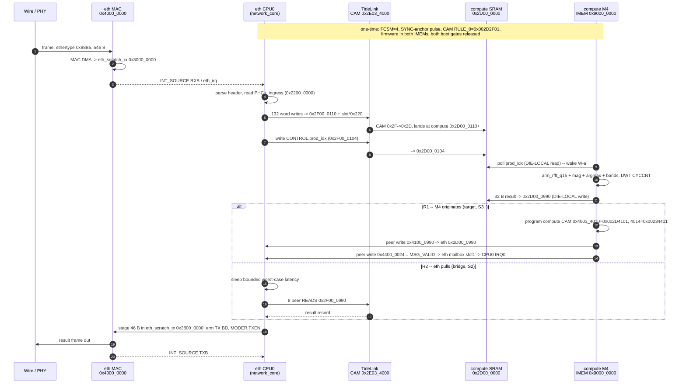

# System application proposal — the heterogeneous eth ↔ compute chiplet pair

**Status:** DESIGN / PROPOSAL, 2026-08-05. No RTL, firmware, or hardware is
produced, modified or executed by this document. It answers one question:

> *What single application should we build that uses **both** chiplets together,
> end to end — data in over Ethernet on the eth die, processed on the compute
> die, result out — and how do we actually get there from where we are today?*

**Scope note.** This is the *heterogeneous* (eth ↔ compute) counterpart to
[`SYSTEM_APP_TRANSPARENT_BRIDGE.md`](SYSTEM_APP_TRANSPARENT_BRIDGE.md), which
designs a transparent two-port Ethernet bridge across a **homogeneous** eth ↔ eth
pair. The two are complementary, not competing: the bridge's story is *transport*
(a frame goes in one die and out the other, unchanged); this document's story is
*offload* (a frame goes in the eth die, gets **computed on a different die**, and
a **result** comes back). The compute chiplet has **no Ethernet MAC at all**, so
the bridge topology is not available here — and that constraint is what makes the
offload story the right one.

---

## Confidence tags

Used on every load-bearing claim, following
[`NanoSoC-Hetrogeneous-Chiplet-Testing/docs/ARCHITECTURE.md`](../../NanoSoC-Hetrogeneous-Chiplet-Testing/docs/ARCHITECTURE.md):

| Tag | Meaning |
|---|---|
| `[PROVEN]` | observed on real hardware (KR260 FPGA), cited |
| `[PROVEN-SIM]` | passes in a committed cocotb/VCS environment, cited |
| `[DERIVED]` | read directly out of RTL or `sys_desc` YAML that is in the tree, but never executed at that address |
| `[TBD]` | not established anywhere — the file that must supply it is named |
| `[BLOCKED]` | cannot exist until a named gap closes |

**Method.** Every address, register and structural claim below is sourced to RTL
or `sys_desc` YAML in preference to prose. Where a prose document and the RTL
disagree, the RTL wins and the disagreement is called out. Nothing is invented;
where a number is not yet knowable it is marked `[TBD]` with the file that must
supply it.

---

## 0. Executive summary

**Recommended application: an Ethernet-fed DSP offload — "spectral feature
extraction as a service".** Blocks of raw signal samples arrive on the eth die as
Ethernet frames; each block is shipped across TideLink into the compute die's
shared SRAM; the Cortex-M4 runs a fixed-point FFT and extracts spectral features;
a small result record comes back and leaves as a response frame. The
demonstration output is a live spectrum / peak-frequency trace **plus the
head-to-head M0+-vs-M4 time for the identical block** — which is literally the
economic argument for a heterogeneous chiplet programme, measured.

**Three findings change the feasibility picture materially, and all three are new
relative to the recorded state in `BRINGUP_GAPS.md` / `KR260_BENCH_RUNBOOK.md`:**

1. **The firmware situation is far better than recorded — and the compute
   toolchain is not merely available, it has already produced built images.**
   `[DERIVED]` The compute repo carries a complete, *committed-and-built*
   firmware tree (M4 bootrom / SPL / app, M0+ manager / manager-stage1; binaries
   dated 2026-08-02) with an installed `arm-none-eabi` toolchain and existing
   `COMPUTE_D2D_PEER_TEST` / `COMPUTE_D2D_LINK_TEST` build knobs.
   **The eth die's CPU0 is cleanly PS-loadable** (IMEM `0x1000_0000`, REMAP
   `0x5000_2000`, boot gate `0x2900_0000`). **The compute M4's load path is
   reachable but has a real reset-ordering trap** that needs one of three
   one-time unlocks. §1.4. **"Blocked on firmware" was really "blocked on a
   firmware *load path*" — and the load path is much closer than `G-FW` implies.**

2. **H2 does not have to be lifted.** `[DERIVED]` H2 constrains `ps_m` only. The
   compute die's *own* initiators `manager_m`, `compute_m` (the M4) and
   `dma_250_0_m` all have `d2d0`/`d2d1` in their target lists, and the YAML
   annotates them "*M4 (data plane) pushes results to a peer die*" and "*DMA-250
   streams payloads to a peer die*" (`nanosoc_compute_soc.yaml:1043-1044`,
   `:1056-1057`, `:1062-1063`). The return path is a **designed feature of the
   compute die**, gated only on something running on it. §3.4.

3. **The Ethernet ingress is in far better shape than the docs say, and blocked
   on one small, specific thing.** `[PROVEN-SIM]` The whole RX path (RMII → MAC →
   DMA → scratch → IRQ) passes at the exact SoC top level the chiplet
   instantiates. The RMII/MDIO pins **are** routed and bonded in the built
   `kr260-eth-chiplet` bitstream. A full ethernet firmware suite exists and has
   moved real ARP frames on PYNQ-Z2. **But** `rmii_ref_clk` is an *input-only*
   port on B11 with no PL source, so with no PHY module fitted the MAC's MII
   clocks do not run **and even internal loopback is dead**. §1.2, §4-W3.

**The honest headline: the ethernet ingress is the largest unbuilt piece, but it
is unbuilt at the *bench* layer, not the design layer.** The single highest-value
FPGA change in this document is a ~1-day BD edit to source `rmii_ref_clk` from a
PL 50 MHz clock, which unlocks a complete MAC datapath demonstration with **no
PHY hardware at all**.

**First stage, reachable in days:** `S0` — a host-driven job/result protocol over
the two proven PS backdoors, with synthetic sample blocks, real cross-die
transport, and the *reference* spectral kernel run on the host. It produces the
end-to-end protocol, the wire format, the CAM programming, the ring layout and
the measurement harness, with zero firmware and zero new hardware. Everything
after that replaces one host-side stub at a time with real silicon.

---

## 1. What is actually true today

This section is the substrate. It is deliberately blunt, because several of the
documents that would normally be trusted here are stale in ways that both
*understate* the hardware and *overstate* the software problem.

### 1.1 The die-to-die link

| Fact | Status | Source |
|---|---|---|
| Homogeneous eth↔eth pair reaches FCSM=4 bilaterally on two KR260s | `[PROVEN]` 2026-07-27 | `docs/KR260_BENCH_RUNBOOK.md` §9; `docs/I1_RESOLVED_HANDOVER_2026_07_31.md` |
| Heterogeneous eth↔compute pair reaches FCSM E=4 C=4 **in simulation**, with cross-die SRAM + mailbox transfers and inbound confinement | `[PROVEN-SIM]` 2026-07-29 | `SIM_PLAN.md` §9a (`HET-MAN-01..04`) |
| Both compute KR260 bitstreams built (`kr260-compute-chiplet` = die_b, `-flip` = die_a); PS window `0x4_0000_0000` confirmed from the `.hwh` | `[PROVEN]` 2026-07-31 | `ETH_COMPUTE_BRINGUP.md` §0 |
| The heterogeneous pair has **never run on hardware** | — | `ETH_COMPUTE_BRINGUP.md` header ("bench run pending") |
| Autonegotiation is broken (**F6**); only the manual `ROLE_CFG` posture reaches FCSM=4 | — | `docs/F6_ATTRIBUTION.md`; `SIM_PLAN.md` §9a |
| Write-only soak: 2000 beats, 0 mismatches, credits steady | `[PROVEN]` homogeneous | `TEST_MATRIX.md` `L5-SOAK-01` |
| Peer **read**-back: flaky; wedged both boards 2026-07-29 | — | `TEST_MATRIX.md` `L4-SRAM-03` (`FLAKY-HOM`); `SAFETY.md` H3 ("worse; the `rd_pipe_r` read-completion guard is absent") |
| The cross-die write wedge is root-caused to the **deskew re-anchor gate**, and there is a host-side fix (pulse `R8 0x2E03_2100 = 0x1C`, wait ~0.4 s, write `0x00`) after which 300-beat and 200-beat soaks run clean | `[PROVEN]` 2026-08-03 | project memory `axirec-fix-does-not-resolve-silicon-wedge`; `docs/PROPOSAL_AUTO_ANCHOR_RTL_2026_08_04.md` |
| The **residual** intermittent wedge is an eye-margin/deskew-alignment lottery, not an AXI-recovery bug; a plain write lands on some deploys and wedges on others, same build | — | `docs/REPLY_AXIREC_RECONCILE_2026_08_04.md` §"What I verified on my rig" |

**Design consequence, and it is a big one.** The link's two directions are not
equally trustworthy: **sustained writes are proven, reads are the fragile path.**
Any application whose return leg is a stream of peer *reads* is betting on the
worst-characterised mechanism. This directly shapes the recommendation in §2:
prefer a workload with **large ingress and small egress**, and prefer a return
mechanism that is a *write from the far die* over a *read from the near die*.

### 1.2 The Ethernet ingress — the real state

**Do not trust the prose here.** `KR260_BENCH_RUNBOOK.md:247-248` and
`KR260_LAN8720_FPGAHUB_PLAN.md:188-191` say "the eth-chiplet has no ethernet
firmware" and list "take the MAC out of internal loopback" as a bring-up task.
Both are wrong against the RTL and the tree.

**What exists and is good:**

| Item | Status | Source |
|---|---|---|
| OpenCores `eth_top` 10/100 MAC + OpenCores HA1588, AHB-wrapped, **instantiated in the chiplet** | `[DERIVED]` | `src/rtl/nanosoc_eth_chiplet.sv:367` → `nanosoc_multicore_soc.sv:833` → `ethernet_ss_ahb_rmii.sv:484` (`ethmac_subsystem_ahb u_ethmac_0`) |
| MAC has its **own AHB master DMA** port, and it is an initiator on the eth-ss matrix | `[DERIVED]` | `ethernet-subsystem-ahb/src/rtl/ethmac_subsystem_ahb.v:49-59`; initiator `ethmac_0_dma`, `sys_desc/ethernet_ss_ahb_rmii.yaml:858-866` |
| **The MAC DMA can reach the `system` passthrough** (`0x2000_0000..0x2FFF_FFFF`) — which contains the D2D window `0x2E`/`0x2F` | `[DERIVED]` | `ethernet_ss_ahb_rmii.yaml:858-866` (`ethmac_0_dma` targets include `system`); `:826` (`system` base `0x20000000`, size `0x10000000`) |
| `rmii_to_mii` adapter converts the 2-bit/50 MHz RMII boundary to 4-bit MII and **generates** `mtx_clk`/`mrx_clk` | `[DERIVED]` | `nanosoc-multicore-system/imp/fpga/nanosoc_multicore_ip/src/rmii_to_mii.v:277-283, 320-326` |
| Full RX path proven end to end **in simulation at the SoC top the chiplet instantiates**: RMII PHY model → MAC → DMA into `eth_scratch_rx_0` → `eth_irq` + `INT_SOURCE.RXB` → byte-exact readback through `eth_ss_0` | `[PROVEN-SIM]` 2026-07-18, 5 tests / 0 failures | `nanosoc-multicore-system/cocotb/soc_ethernet/test_soc_ethernet.py:190-250`, `tb_top.sv:92-101` |
| RMII + MDIO pins routed, constrained and **bonded in the built bitstream** (IOB 34, +9 over the no-ethernet build) | `[PROVEN]` (build artifact) | `tidelink/fpga/targets/kr260-eth-chiplet/kr260_eth_chiplet_tidelink.xdc:67-95`; `imp/fpga/output/kr260-eth-chiplet/BUILD_NOTES.md:66` |
| A large ethernet firmware suite exists **in the chiplet's own submodule** — PicoTCP netapp (ARP/ICMP/UDP/HTTP/TFTP), `eth_ping_responder`, `eth_rx_live`, `eth_phy_link`, `eth_phy_regs`, `eth_mac_loopback`, PTP capture apps | `[DERIVED]` | `nanosoc-multicore-system/firmware/apps/`; catalogued in `nanosoc-multicore-system/docs/APPLICATIONS.md:75-88, 235-259` |
| That firmware has moved **real ARP frames** (rx_cnt increments, ethertype `0x0806`, 5 requests / 5 replies) — on PYNQ-Z2, same SoC RTL | `[PROVEN]` 2026-07-09 | `nanosoc-multicore-system` commit `60230d4`; `docs/H2_TRIAL_BOOT_CONFIRM_DESIGN.md:179-194` |
| MDIO master (`eth_miim`) in RTL; MDIO driver in firmware | `[DERIVED]` | `ethernet-mac-ahb/flist/ethmac_ahb_rmii.flist`; regs `MIIMODER..MIISTATUS` `0x28..0x3C` (`src/rdl/ethmac_regs.rdl:233-306`); `src/sw/ethmac.c:62-115` |
| **`MODER.LOOPBK` (bit 7) resets to 0** — the MAC is *not* in loopback; after reset it is simply disabled (`TXEN=RXEN=0`) | `[DERIVED]` | `ethernet-mac-ahb/src/rdl/ethmac_regs.rdl:61-62`; no RTL forces it |

**What is missing, in the order that actually blocks a frame:**

| # | Gap | Why it blocks | Source |
|---|---|---|---|
| **E-a** | **`rmii_ref_clk` has no source when no PHY is fitted.** It is an *input-only* BD port on ball B11 (PMOD1.10) with `create_clock -period 20.000`. `mtx_clk` and `mrx_clk` are both free-running divisions of it. **No REF_CLK ⇒ no MII clocks ⇒ the MAC datapath is frozen, including internal loopback.** | Blocks *every* MAC demonstration on today's bitstream | `kr260_eth_chiplet_tidelink.xdc:93-95`; `tidelink_design.tcl:65, 215`; `rmii_to_mii.v:277-283, 320-326` |
| **E-b** | **No PHY module has ever been fitted to a KR260.** The pins place and route; nothing has driven them. | Blocks real-wire ingress | `docs/KR260_LAN8720_FPGAHUB_PLAN.md:37-38`; `KR260_BENCH_RUNBOOK.md` §7 (M2) |
| **E-c** | **No firmware image is loaded on the chiplet's CPU0.** No IMEM `.hex` in the packaged chiplet IP; QSPI tied off in the FPGA wrapper, so stage-0 has nothing to boot from. The apps exist but have no chiplet build/deploy target. | Blocks anything CPU0-driven — **but see §1.4, the load path exists** | no `.hex` under `tidelink/imp/fpga/eth_chiplet_ip/`; `tidelink/fpga/vivado_ip/nanosoc_eth_chiplet_vivado_wrapper.v:250+` |
| **E-d** | **No host-side MAC or MDIO tooling.** Every script in `tidelink/pynq_host/scripts/` targets the TideLink APB at `0x2E03_xxxx`; none touches `0x4_4000_0000`. | Blocks host-driven MAC bring-up | grep of `tidelink/pynq_host/scripts/` |
| **E-e** | **The PS→`eth_ss_0` backdoor drops bit 27** on some reads (boot-ROM reset/NMI/HardFault vectors read `0x000001xx`, expect `0x080001xx`; the init-MSP word reads clean). Characterised, **waived by default in CI**, unfixed. | Corrupts host-side payload verification. Any byte-exact check over this path is suspect until re-characterised | `tidelink/pynq_host/scripts/eth_ss_probe.py:12-22`; `docs/I1_RESOLVED_HANDOVER_2026_07_31.md:58, 99` |
| **E-f** | RMII link speed is hardwired to 100 Mbps; no autoneg feedback into the adapter | Limits, does not block | `nanosoc_multicore_soc.yaml:549-562` (KNOWN LIMITATION #11) |
| **E-g** | `IOB TRUE` on the RMII TX pins was deliberately **not** ported from the working Z2 build; REF_CLK sits on a non-CCIO pin with `CLOCK_DEDICATED_ROUTE FALSE` | Bench risk at real line rate | `kr260_eth_chiplet_tidelink.xdc:82-95`; `KR260_LAN8720_FPGAHUB_PLAN.md:194-196` |
| **E-h** | No fpgahub topology for the ethernet ports: no `kr260_0{1,2}_pl` entries, no per-die `pl_mac` (both dies would boot an identical compiled-in MAC address), no ethernet actions | Blocks automation, not the first demo | `KR260_LAN8720_FPGAHUB_PLAN.md:100-131, 187-197` |

**Bottom line on ethernet: RTL ≈ complete and sim-proven; firmware ≈ written but
never deployed on this platform; bench ≈ zero.** The chiplet's Ethernet has never
moved a bit on hardware. That is the truth, and the staged plan in §5 is built so
that it does not have to be true before the programme has something to show.

### 1.3 The eth die's address map, as the PS actually sees it

This matters more than it looks, and it is not what `ARCHITECTURE.md` implies.

The chiplet's top-level `eth_ss_0_*` port — the PS backdoor — is **not** a
top-matrix port. It is wired to the ethernet subsystem's *second* admin slave
(`u_network_core.eth_ss_1`), so it enters the eth subsystem and uses the
subsystem's internal decode. `[DERIVED]` (`nanosoc_multicore_soc.yaml:523`:
`- { port: eth_ss_1, conn: eth_ss_0 }`). The `eth_ss_1` initiator's target list is
the *full* subsystem map (`ethernet_ss_ahb_rmii.yaml:899-916`).

**Therefore the PS sees CPU0's local view, and reaches the MAC directly:**

| SoC / CPU0-local | PS phys | What | Size | Source |
|---|---|---|---|---|
| `0x0000_0000` | `0x4_0000_0000` | boot ROM (alias; default `0x0800_0000`) | 8 KB (`ETH_BOOTROM_ADDR_W=11`) | `ethernet_ss_ahb_rmii.yaml:821` |
| `0x1000_0000` | `0x4_1000_0000` | **CPU0 IMEM** | **32 KB** | `:822`; `nanosoc_multicore_soc_memmap.h:17-18` |
| `0x1800_0000` | `0x4_1800_0000` | CPU0 DMEM | 16 KB | `:823`; `memmap.h:20-21` |
| `0x2000_0000`–`0x2FFF_FFFF` | `0x4_2xxx_xxxx` | **`system` passthrough → SoC top matrix** | 256 MB | `:826` |
| `0x3000_0000` | `0x4_3000_0000` | eth scratch **RX** SRAM | **8 KB** | `:827`; `memmap.h:22-23` |
| `0x3800_0000` | `0x4_3800_0000` | eth scratch **TX** SRAM | **8 KB** | `:828`; `memmap.h:24-25` |
| `0x4000_0000` | **`0x4_4000_0000`** | **Ethernet MAC registers** | — | `:829` |
| `0x4000_1000` | `0x4_4000_1000` | HA1588 PTP (MAC base + `0x1000`) | — | `ethernet-mac-ahb/src/rtl/ethmac_subsystem_apb.v:12` |
| `0x4000_0400`–`0x4000_07FF` | `0x4_4000_04xx` | MAC BD table (128 × 8 B) | 1 KB | `ethernet-mac-ahb/src/sw/ethmac.h:66-90` |
| `0x4800_0000` | `0x4_4800_0000` | CRC-32/IEEE accelerator | — | `ethernet_ss_ahb_rmii.yaml:830` |
| `0x5000_0000` | `0x4_5000_0000` | CPU0 APB block (timer / UART / sysctrl) | — | `:831` |
| `0x5000_2000` | `0x4_5000_2000` | **`eth_ss_sysctrl` REMAP**, offset `0x000` bit 0 RW → `sys_remap_ctrl[0]` (0x0 aliases IMEM) | — | `ethernet-subsystem-ahb/src/rtl/apb_subsystem/eth_ss_sysctrl.v:14, 49-63` |

And through the `system` passthrough onto the top matrix (initiator `eth_ss_m`,
whose target list is `nanosoc_multicore_soc.yaml:2214-2232`):

| SoC | PS phys | What | Source |
|---|---|---|---|
| `0x2200_0000` | `0x4_2200_0000` | PHC (PTP hardware clock) | `nanosoc_multicore_soc.yaml:2166` |
| `0x2300_0000` | `0x4_2300_0000` | IPC mailbox — **inbound D2D target #2** | `:2167` |
| `0x2900_0000` | `0x4_2900_0000` | **`chip_core_remap_0`** — bit0 REMAP(CPU1), bit1 BOOTGATE(CPU1), **bit2 BOOTGATE(CPU0/network_core)**, write-1-set | `:2172`; `firmware/include/nanosoc_multicore_addrmap.h:154-165` |
| `0x2D00_0000` | `0x4_2D00_0000` | `shared_sram_0` — **inbound D2D target #1**, **8 KB** | `:2169`; `memmap.h:36-37` |
| `0x2E03_0000` | `0x4_2E03_0000` | TideLink APB | `ARCHITECTURE.md` §4.2 `[PROVEN]` |
| `0x2E03_4000` | `0x4_2E03_4000` | CAM (`BASE_OFFSET`/`CTRL`+4/`RULE_0`+0x10) | `ARCHITECTURE.md` §4.2 `[PROVEN]` |
| `0x2F00_0000` | `0x4_2F00_0000` | **peer aperture, 16 MB** — the whole of `haddr[24]==1` | `src/rtl/chiplet_d2d_decode.sv:43, 138, 147` |

> **The eth die has exactly ONE peer aperture.** `chiplet_d2d_decode.sv:138` is
> `wire a_peer = haddr[24];` — "*all of 0x2F is the peer window*". There is no
> `NUM_PEER_BYTES` run on this die (that is the compute-side decoder's
> parameterisation). Since the CAM rewrites only `addr[31:24]`, the eth die
> **cannot reach far-die SRAM and far-die mailbox concurrently** — it must
> reprogram the CAM replace byte between them. This single fact shapes the
> doorbell design in §3.3. `[DERIVED]`

> **What the PS canNOT reach on the eth die:** `cpu_ss_1_slave` at `0x8000_0000`
> (CPU1's bootrom/IMEM/DMEM). The eth-ss `system` passthrough spans only
> `0x2000_0000..0x2FFF_FFFF`, so `0x8000_0000` falls in no eth-ss region.
> **CPU1 (chip_core) firmware is therefore *not* PS-loadable** — only CPU0 is.
> That is fine: CPU0 (`network_core`) is the core that owns the MAC *and* the D2D
> peer aperture (`nanosoc_multicore_soc.yaml:2229-2232`). `[DERIVED]`

### 1.4 ★ The firmware-load path — most of `G-FW` is already solved

The recorded position across both repos is that firmware is blocked: *"Both boot
cores halt on an unprogrammed QSPI flash"* (`SIM_PLAN.md` §9b), *"needs the SWD
probe + firmware"* (`docs/CROSS_DIE_INTERRUPTS.md:49-51`), `L4-IRQ-04` /
`L4-DMA-01` / `L4-ETH-02` all `BLOCKED-G-FW`. The premise is that getting code
onto a core is a large, unstarted piece of work.

**It is not.** One die's load path is clean and PS-only; the other's needs a
single one-time unlock; and the compute-side firmware tree and toolchain **already
exist and have produced built binaries**.

#### 1.4.1 The eth die's CPU0 — clean, PS-only, three writes `[DERIVED]`

| Step | Write | Why it works |
|---|---|---|
| 1 | image → PS `0x4_1000_0000` (IMEM, 32 KB) | `eth_ss_1` reaches `imem_0` (`ethernet_ss_ahb_rmii.yaml:899-916`), `sw_access: rwx` |
| 2 | PS `0x4_5000_2000` = `0x1` (REMAP) | `eth_ss_sysctrl.v:57` — `remap_reg <= PWDATA[3:0]`, plain RW; bit 0 drives `sys_remap_ctrl[0]` so CPU0's `0x0` aliases IMEM |
| 3 | PS `0x4_2900_0000` = `0x4` (write-1-set) | `NANOSOC_NETWORK_CORE_BOOTGATE` = bit 2, folds into `cpu0_resetn`, PORESETn-only storage (`nanosoc_multicore_addrmap.h:158-165`); `eth_ss_m` has `chip_core_remap_0` as a target (`nanosoc_multicore_soc.yaml:2226`) |

**And the unprogrammed flash is an *advantage* here.** CPU0's gate is released by
CPU1's stage-0 *"once QSPI XiP is up"* (`nanosoc_multicore_addrmap.h:158-162`).
With flash unprogrammed, XiP never comes up, CPU1 never writes `0x4`, and **CPU0
sits cleanly gated waiting for the PS** — exactly the state the load path wants.
There is also a PS-reachable belt and braces: `reset_ctrl_0` at `0x2A00_0000` is a
per-core reset controller and `eth_ss_m` has it as a target
(`nanosoc_multicore_soc.yaml:2227`).

Whether CPU1 (`chip_core`, the SoC clock/reset master) is itself gated at POR on
the FPGA build is `[TBD]` — if the PS needs it running, write `0x6` rather than
`0x4`. Settled by `src/rtl/wrappers/chip_core_remap_ctrl.v` + `nanosoc_reset_ctrl`.

#### 1.4.2 The compute die's M4 — reachable, but there is a reset-ordering trap

**The reach is real.** `ps_m` has both `compute_admin` (`:1123`) — the M4's
bootrom/IMEM/DMEM at `0x80M`/`0x90M`/`0x98M`, `sw_access: rwx`
(`nanosoc_compute_soc.yaml:1024`) — and `core_remap_0` (`:1117`), whose single
write-1-set register carries bit0 REMAP and bit1 BOOTGATE
(`core_remap_ctrl.v:17-31`).

**But the naive sequence does not work, for three interlocking reasons:**

1. **The manager releases the M4 within microseconds of power-on,
   unconditionally.** The M0+ manager's stage-0 ROM writes
   `REG32(0x29000000) = 0x2` *before* it has validated any flash content
   (`compute-subsystem/firmware/manager/main.c:139`). The M4 is out of reset and
   executing from its BootROM long before the PS can act.
2. **The M4's BootROM then parks.** It waits on the manager's XiP-WARM flag at
   mailbox `0x2A00_0010` (`bootrom/main.c:43-44`) — which the manager *does* post
   (`manager/main.c:143`) — then reads the boot table at `0x2400_0000`, finds no
   `'BOOT'` magic in unprogrammed flash, and spins forever in `boot_fail`, leaving
   a breadcrumb at `0x2D00_00FC` (`bootrom/main.c:31`; `libboot.c:19-27`).
3. **Nothing the PS can reach will reset the M4.** BOOTGATE is write-1-set with no
   software clear, cleared only by `PORESETn` — which would clear it too
   (`core_remap_ctrl.v:39-53`). The only other reset is the M4's own AIRCR
   `SYSRESETREQ`, and `nanosoc_compute_rstctrl.v:69-97` shows `rst_hold` is
   latched *from `sysresetreq` alone* — there is no external hold input. `ps_m`
   also does not reach `compute_dbg_window`, so there is no PPB route either.

Setting REMAP after the fact therefore achieves nothing: the M4 is already running
out of BOOTROM, and moving the `0x0` alias under a running core is a crash, not a
boot.

**Three one-time unlocks, in ascending cost. Any one is sufficient, and after any
one of them PS-driven firmware iteration is free.**

| | Unlock | Cost | Notes |
|---|---|---|---|
| **U1** | **Add a PS escape hatch to the M4 BootROM** — after the wait-flag, check a magic word in shared SRAM (e.g. `0x2D00_0040 == 'IMEM'`) and `boot_handoff(0x1000_0000)` instead of reading flash | ~10 lines of C + **one bitstream rebuild** | **Recommended.** Idiomatic: the shipped app already uses exactly this convention (`'MRST'` @ `0x2D00_0040` + `'ARMD'` @ `0x2D00_0048` → the M4 issues its own SYSRESETREQ, `app/main.c:60-69`). One rebuild buys unlimited PS-side firmware iteration with no flash and no probe. |
| **U2** | **Preload M4 IMEM at bitstream build** — `compute_ss.yaml:57` already exposes `IMEM_MEM_FPGA_IMG` (default `"image.hex"`), wired into the IMEM instance at `:147` | a Vivado run per image | Works, but every firmware change is a rebuild. Best used *once*, to bake in U1's stub. |
| **U3** | **SWD on the compute board** — `dap_m` reaches `compute_admin`, `core_remap_0` **and** `compute_dbg_window`, and `dbgen`/`spiden` are tied `1` (`nanosoc_compute_soc.yaml:698-706`) | an SWD probe + wiring | Fully general and standard. Also the fallback if the boot gate misbehaves. |
| — | *Program the QSPI flash* (`tools/mkbootimg.py` exists) | `[TBD]` whether `ps_m` can page-program through `qspi_flash_0` | The "designed" path. The eth side has a proven TFTP-to-flash flow on Z2, so the controller can program — not investigated here. |

> **One further warning, and it is real.** The compute boot gate was **once broken
> on silicon** — a bare combinational gate released the M4 in cocotb but not on
> hardware (*"z2_04: M4 stuck in reset with BOOTGATE set"*), because reset removal
> was async to the compute clock. It has been replaced by `u_compute_rstctrl_0`, a
> proper async-assert / sync-deassert synchroniser
> (`nanosoc_compute_soc.yaml:273-280`; `nanosoc_compute_rstctrl.v:94-103`).
> **The fix is in the RTL; it has not been re-proven on hardware.** `S1` proves it.

#### 1.4.3 The compute firmware tree already exists — and is built

This is the part that most changes the effort estimate. `[DERIVED]`

* **Sources:** `compute-subsystem/firmware/` — `bootrom/` (M4, 2 KB), `spl/` (M4),
  `app/` (M4), `manager/` (M0+), `manager_stage1/` (M0+, **which already contains
  TideLink D2D bring-up**), `common/compute_mem.h` (283 lines, the definitive
  memory map), `tools/mkbootimg.py`, host-side CRC unit tests.
* **`compute_mem.h` already carries `0x4100_0000` as the D2D0 peer aperture and
  `0x4003_0000` as the link-0 TideLink APB** — independent firmware-side
  corroboration of the `0x41` derivation that `hetsoc` marks `[DERIVED]`.
* **Built artifacts are committed**, dated 2026-08-02: `bootrom.bin` 1048 B,
  `spl.bin` 924 B, `app.bin` 300 B, `manager.bin` 690 B,
  `manager_stage1.bin` 528 B.
* **Toolchain is installed and on `PATH`** — `arm-none-eabi-gcc`, built with
  `-mcpu=cortex-m4 -mthumb -mfpu=fpv4-sp-d16 -mfloat-abi=hard`
  (`firmware/Makefile:50`).
* Build knobs `COMPUTE_D2D_PEER_TEST`, `COMPUTE_D2D_LINK_TEST` and
  `COMPUTE_D2D_ROLE_MASTER` already exist.
* ⚠ A documented **boot-flow signature map occupies compute `shared_sram_0`
  `+0x00`…`+0xFC`** (`compute_mem.h:102-160`) — `'mgr!'`, `'SPL!'`, `'STG1'`,
  `'LOCK'`, `'IRQ!'`, D2D linkup/xfer words, BootROM breadcrumbs. **Any
  application ring must start above `+0x0100`.** §3.2 does.
* A Zephyr board port exists (`zephyr/boards/soclabs/nanosoc_compute/`) but has
  **no build artifacts anywhere** — treat it as untested. Its DTS also declares
  `arm,num-irq-priority-bits = <3>` against RTL `LVL_WIDTH=4`.

**Net effect on `G-FW`:** on the eth die it is retired by three register writes;
on the compute die it reduces to *one* bitstream rebuild carrying a ten-line
BootROM stub (**U1**), after which firmware iteration is a `devmem` away. That is
weeks removed from the critical path, and it is why `S1` in §5 is measured in
days-to-a-fortnight rather than quarters.

### 1.5 The compute die

*(Confirmed from `NanoSoC-Compute-Chiplet` @ `d4833be`,
`nanosoc-compute-system/sys_desc/nanosoc_compute_soc.yaml`.)*

**The Cortex-M4 is exactly the core this application wants.** `[DERIVED]`
`u_compute` → `compute_ss` → `slcorem4` → `CORTEXM4INTEGRATION`
(`nanosoc_compute_soc.yaml:257-263`; `compute_ss.yaml:96-99`), with
**`FPU_PRESENT = 1`** (FPv4-SP single precision), `MPU_PRESENT=1`, `NUM_IRQ=64`,
`BB_PRESENT=1`, `TRACE_LVL=1` (ITM/DWT — so `CYCCNT` is available for the
speed-up measurement, but no ETM) — `compute_ss.yaml:37-47`, and **confirmed
baked into the synthesised netlist**, whose elaborated module name is
`CORTEXM4_..._BB_PRESENT1_CONST_AHB_CTRL0_FPU_PRESENT1`
(`ASIC/genus-innovus/outputs/nanosoc_compute_chiplet_elab.v`). There is no DSP
parameter because on Cortex-M4 the **DSP extension is architecturally mandatory**
— only the FPU is optional. So this is full **Armv7E-M: SIMD + single-cycle MAC +
saturating arithmetic + FPv4-SP**, built with
`-mcpu=cortex-m4 -mfpu=fpv4-sp-d16 -mfloat-abi=hard` (`firmware/Makefile:50`).

**Clocks and memory:**

| | Value | Source |
|---|---|---|
| KR260 core clock (`sys_hclk == sys_fclk`, `CLKGATE_PRESENT=0`) | **25 MHz** | `kr260-compute-chiplet/tidelink_design.tcl:126` `CLKOUT1_REQUESTED_OUT_FREQ {25.000}`, `:208` |
| KR260 timing | WNS **+12.30 ns**, TNS 0, 0 failing endpoints of 113 389 | `..._timing_summary_routed.rpt:178-180` |
| ASIC SDC default | 50 MHz (20 ns) | `ASIC/genus-innovus/inputs/constraints.sdc:20-24` |
| M4 BootROM / IMEM / DMEM | **2 KB / 32 KB / 32 KB**, no TCM (plain AHB-attached) | `compute_ss.yaml:54-59` |
| `shared_sram_0` | **8 KB** (16 MB decode window, 8 KB backed) | `:40`, `:1013` |

> ⚠ The packaged IP declares `FREQ_HZ 50000000` on `sys_fclk`
> (`nanosoc_compute_chiplet_vivado_wrapper.v:64`) while the BD drives 25 MHz.
> Metadata only — but **budget the M4 at 25 MHz on this bench**, not 50.

| Region | Base | Notes | Source |
|---|---|---|---|
| `dma_250_0` (APB cfg) | `0x2000_0000` | ch0 frame at `0x2000_1100` | `:1006`; `compute_mem.h:30` |
| `qspi_flash_0` (APB cfg) | `0x2100_0000` | | `:989` |
| `qspi_flash_xip` | `0x2400_0000` | 4 MB cached XiP read aperture | `:1002` |
| `manager_periph_0` | `0x2800_0000` | CMSDK APB incl. the **only UART** (`0x2800_6000`) — **the M4 cannot reach it** | `:1005`; `compute_mem.h:85-90` |
| `core_remap_0` | `0x2900_0000` | M4 REMAP (bit0) + BOOTGATE (bit1), write-1-set | `:1003` |
| `ipc_mailbox_0` | **`0x2A00_0000`** | inbound D2D target #2 — **not `0x23`**: `0x22`–`0x23` is the M4's **SRAM bit-band alias** | `:994`, `:1092-1104` |
| `phc_0` | **`0x2B00_0000`** | ⚠ **not `0x22`** as on the eth die. 4 KB, free-running | `:1012` |
| `hw_spinlock_0` | `0x2C00_0000` | 16 locks, per-master page by `HADDR[9:8]` | `:1007`; `compute_mem.h:92-99` |
| `shared_sram_0` | `0x2D00_0000` | inbound D2D target #1 — **8 KB**; `+0x00..0xFC` is the **boot-signature map**, keep application data above `+0x100` | `:1013`; `compute_mem.h:102-160` |
| `mgr_remap_0` | `0x2E00_0000` | ⚠ a **live peripheral** where the eth die has its TideLink window | `:1004` |
| `d2d0` | `0x4000_0000` | 256 MB link-0 window; TLAPB `0x4003_0000`, CAM `0x4003_4000`, TideChart `0x4004_0000`; peer `0x41` (SRAM) / `0x44` (mailbox) | `:1022`; `compute_mem.h:197-229`; `hetsoc/targets.py:802-811` |
| `d2d1` | `0x6000_0000` | link 1, no TideChart, tied off on the KR260 build | `:1023`; `ETH_COMPUTE_BRINGUP.md` §2 |
| `compute_admin` | `0x8000_0000` | 512 MB; M4 bootrom `0x80M` / **IMEM `0x90M`** / DMEM `0x98M` | `:1024` |
| `manager_dbg_window` / `compute_dbg_window` | `0xA000_0000` / `0xB000_0000` | DAP-only | `:1027-1028` |

**Initiator grants — the H2 picture.** From `:1030-1084` / `:1106-1123`, and
**cross-checked against the generated decoders**
(`compute_matrix_decode_<M>.v`), so this is synthesised truth, not just intent.
Target indices: 0 qspi_cfg · 1 ipc_mbx · 2 xip · 3 core_remap · 4 mgr_remap ·
5 mgr_periph · 6 dma_cfg · 7 spinlock · 8 phc · 9 shared_sram · **10 d2d0** ·
**11 d2d1** · 12 compute_admin · 13/14 dbg windows.

| Initiator | Decodes | `d2d0`/`d2d1`? | `compute_admin`? | `core_remap_0`? |
|---|---|---|---|---|
| `manager_m` (M0+) | 0–12 | **yes** — "*manager can master into either remote die*" | yes | yes |
| `compute_m` (**M4**) | 0,1,2,3,6,7,8,9,**10**,**11** | **yes** — "*M4 (data plane) pushes results to a peer die*" | no | yes |
| `dma_250_0_m` | 2,9,**10**,**11**,12 | **yes** — "*DMA-250 streams payloads to a peer die*" | yes | no |
| `dap_m` (SWD) | 0–9,12,13,14 | **no** — deliberately excluded | yes | yes |
| **`ps_m`** (PS backdoor) | 0–9,12 | **no — this is H2** | **yes** | **yes** |
| `d2d0_m`/`d2d1_m` (inbound) | 1,9 | — | no | no |

**Two consequences of that table that shape the firmware:**

* **The M4 cannot reach the UART** (index 5 absent). Independently confirmed by
  the Zephyr board config — `CONFIG_SERIAL=n`, `CONFIG_RAM_CONSOLE=y`, *"the M4
  has NO UART access"*
  (`zephyr/boards/soclabs/nanosoc_compute/..._cm4_defconfig:7-11`).
  **All M4 observability must go through shared SRAM or the mailbox.** Plan for
  it from `FC1` — the boot-signature convention (`compute_mem.h:102-160`) is
  exactly this pattern and should be extended, not replaced.
* **The M4 has only 17 of its 64 NVIC lines connected** (`pad_zero_above: 17`,
  `:961`): bit 0 = IPC mailbox, bits 1–8 = `d2d0_irq[7:0]`, bits 9–16 =
  `d2d1_irq[7:0]`. **No timer, no UART, no DMA-done, no PHC interrupt.** It is
  deliberately a pure data-plane core — which suits this application exactly, but
  means the M4 must **poll** for anything not mailbox- or D2D-sourced (including
  DMA-250 completion, whose `DMA_DONE` goes to the *manager's* NVIC[8], `:907`).

**DMA-250** `[DERIVED]` — `u_dma_250_0`, cfg at `0x2000_0000`
(`nanosoc_compute_soc.yaml:455-480`, `:1006`), channel-0 frame `0x2000_1100`.
`DMA250_NUM_VCH=2` virtual channels over **one physical channel**, and firmware
notes CH0 is *"the only channel proven to run the engine in sim"*
(`compute_mem.h:28-29`). `HAS_TRIG=0` and `DMA_REQ` is tied `4'b0000` (`:478`) —
**software-initiated transfers only.** It reaches `shared_sram_0`, `d2d0`, `d2d1`,
`qspi_flash_xip` and `compute_admin`. It is therefore a genuine option for the
`R1` bulk write (§3.4) — worth measuring against plain M4 stores, but not
required.

**Cross-die interrupt delivery into the M4** `[DERIVED]`:

* IPC mailbox: `cpu1_irq = slot0_msg | slot1_ack`
  (`inter-processor-communications-ahb/src/rtl/ipc_mailbox_apb_regs.sv:262`),
  and on the compute die `cpu1_irq → ipc_compute_irq_w` → **M4 NVIC bit 0**
  (`nanosoc_compute_soc.yaml:397-398`, `:938`).
  ⇒ **a far-die write of mailbox slot-0 `MSG_VALID` at compute `0x2A00_0020`
  raises M4 IRQ 0.**
* TideLink sideband doorbell: `d2d0_irq[0]` → **M4 NVIC bit 1**
  (`nanosoc_compute_soc.yaml:945`).
* Mailbox register map: slot-0 data `+0x000..0x00C`, slot-0 ctrl `+0x020`
  (bit0 `MSG_VALID`, bit1 `ACK`), `IRQ_STATUS +0x028` (R/W1C), `IRQ_ENABLE +0x02C`
  (`ipc_mailbox_apb_regs.sv:7-14`).

**The return direction into the eth die**, symmetrically: on the eth die
`cpu0_irq = slot0_ack | slot1_msg` (same RTL line 261), and the eth mailbox's
`cpu0_irq` goes to `network_core` (`nanosoc_multicore_soc.yaml:967`). ⇒ **a
compute-originated write of mailbox slot-1 `MSG_VALID` at eth `0x2300_0024`
raises eth CPU0 (the MAC-owning core).** That is exactly the right core.

**Known compute-side limits carried into the design:**

* **PTP over D2D is `[BLOCKED]`** — the compute SoC uses the short `phc_ahb`
  variant, so TideLink's `phc_seconds`/`phc_nanoseconds` are **tied to 0, per
  link** (`nanosoc_compute_chiplet.sv:49-54`; `BRINGUP_GAPS.md` G14). Any design
  that needs a *synchronised clock* across the pair is blocked. Carrying
  timestamps as **payload** is not.
* **Peer aperture `0x41`/`0x44` is `[DERIVED]`, not verified with
  `chiplet_d2d_decode` in path** — both compute testbenches bypass the decoder
  (`verif/g2_soc_peer_aperture/tb_soc_pair.sv:163-164`), so their passing
  `0x40`-based tests do not validate the address the real chiplet uses
  (`ARCHITECTURE.md` §4.3 hazard 1; `hetsoc/targets.py:770-775`). This is moot
  for eth→compute and **load-bearing for the return path**. `L0-SIM-15`.
* `ps_reaches_d2d = False` is **measured**, not assumed: over `ps_ahb_s`,
  `0x40032080/2084/2108` all read `0x00000000` and the role never locks, while a
  write + read-back to `0x2D00_2000` returns `0xa5a5beef` (`SIM_PLAN.md` §9c C1).
* **The TideChart capability descriptor is stale, and it is baked into silicon.**
  `nanosoc_compute_chiplet.sv:1100-1102` overrides only `NUM_PORTS(2)` and
  `FC_DATA_W(48)`; everything else takes RTL defaults, visible in
  `ASIC/genus-innovus/outputs/nanosoc_compute_chiplet_elab.v`: `COMPUTE_CLASS =
  8'h01` (documented as *"Cortex-M0 class"*, `sys_desc/tidechart.yaml:105` — wrong
  for an M4F die), `DAP_PRESENT = 0` (wrong — there is a full SoC-400 SWJ-DP),
  `NUM_DEBUG_CORES = 1` (wrong — two), `SRAM_BLOCK_COUNT = 0`, `ACCEL_COUNT = 0`.
  **If any part of this application does peer capability discovery, do not trust
  these fields.** (Note also that `SRAM_BLOCK_COUNT=0` is a *TideChart descriptor*
  field, not a statement about memory — the 8 KB `shared_sram_0` exists and is
  fully usable; it is simply not advertised.)
* **Bitstream provenance is broken.** `kr260-compute-chiplet/tidelink_manifest.json`
  reports `git_dirty: true` and `source_commit a60d581…`, which is not the repo
  HEAD `d4833be`. **The shipped compute bitstream is not reproducible from the
  current tree** — establish what is actually in it before debugging a surprise.

---

## 2. Candidate applications

The brief is a workload where **offloading to a separate compute die is the
point**: a visible input, a computation that plausibly belongs on a Cortex-M4
with DSP/FPU rather than the eth die's M0+, and an observable output. Three
candidates, scored against the constraints established in §1.

### Candidate A — Ethernet-fed DSP offload: streaming spectral feature extraction

Blocks of raw signal samples arrive as Ethernet frames. Each block crosses to the
compute die, the M4 runs a fixed-point FFT plus feature extraction, and a small
result record returns and leaves as a response frame. Concretely: vibration /
acoustic **condition monitoring** — the canonical "sensor on the network, DSP in
the box" workload.

* **Why the M4 and not the M0+:** an N-point fixed-point FFT is dominated by
  multiply-accumulate. Armv7E-M gives the M4 single-cycle 32×32 MAC, SIMD
  (`SMLAD`/`SMUAD`), saturating arithmetic and (with the FPU) single-precision
  float — none of which Armv6-M gives the M0+, whose multiply is the only integer
  multiply it has and which has no SIMD at all. **The size of the gap is a
  measurement this demo produces, not an assumption this document makes** — see
  §6, `M-1`.
* **Data shape: large in, small out.** ~512 B of samples in, ~32 B of features
  out — a **16:1 asymmetry** that lands the heavy traffic on the *proven* write
  direction and puts almost nothing on the fragile return leg (§1.1).
* **Fits the memory:** 8 KB of shared SRAM per die is the entire landing zone. A
  4-deep job ring of (16 B descriptor + 512 B payload) is 2112 B, and a 4-deep
  result ring of 32 B is 128 B — under 30 % of the budget. §3.2.
* **Observable:** a live spectrum / peak-frequency trace on the host, tracking a
  swept synthetic tone. Wrong answers are visually obvious, which is worth a
  great deal in a demo.
* **Extends without redesign:** the identical datapath later carries a CMSIS-NN
  int8 classifier (anomaly detection / keyword spotting) — a bigger story with
  **no change to the transport, the ring, the CAM rules or the doorbell**.

### Candidate B — Inline packet-processing offload ("split smart NIC")

Every received frame crosses to the compute die, where the M4 classifies /
transforms / authenticates it, and the frame (or a verdict) returns for egress.
The product story is legible: expensive per-packet work on its own die.

* **Fatal shape mismatch: the traffic is symmetric.** Every byte that goes must
  come back. That doubles the load on the link *and* puts half of it on the
  return leg — the direction that has never run on hardware, using the mechanism
  (`L4-SRAM-03`) that is `FLAKY-HOM`. It is the worst possible fit for §1.1.
* **The M4 justification is weak for the obvious kernels.** CRC and checksum are
  not DSP work — and the eth subsystem already has a **CRC-32/IEEE hardware
  accelerator at `0x4800_0000`** (`ethernet_ss_ahb_rmii.yaml:830`), which
  actively undercuts the argument. AES/SHA on an M4 without a crypto extension
  is perhaps 2–3× an M0+, not the order of magnitude the programme wants to show.
* **Latency-critical**, so any wedge is immediately fatal to the demonstration
  rather than merely a dropped sample.

### Candidate C — PTP-timestamped distributed control / sensor fusion

The eth die is PTP grandmaster (it is the only die with a MAC and HA1588);
timestamped sample streams cross to the compute die, which fuses them against a
shared timebase and returns an actuator command. This is the most *chiplet-native*
story — time-aware compute across dies is exactly why you put 1588 on a D2D link.

* **Blocked in RTL.** `G14`: the compute SoC's short `phc_ahb` variant leaves
  TideLink's `phc_seconds`/`phc_nanoseconds` **tied to 0 on both links**
  (`nanosoc_compute_chiplet.sv:49-54`). Cross-die time transfer needs a compute
  SoC change, regeneration and a bitstream rebuild. `[BLOCKED]`
* Also needs a real sensor, a real actuator, and an independent time reference to
  measure against — none of which exist on the bench.
* **But the good part is free.** The eth die can PHC-timestamp each ingress block
  locally (`0x2200_0000`, and `ETH_RX_CAP` driven by
  `ethernet-mac-ahb/src/rtl/ptp_event_detector.v`) and put the timestamp **in the
  job header as payload**. Candidate A does exactly that, which buys the
  "time-aware pipeline" narrative with none of the `G14` blocker.

### Recommendation

> ## **Build Candidate A.**

| Criterion | A (DSP offload) | B (smart NIC) | C (PTP control) |
|---|---|---|---|
| "Offload is the point" | **strong** — the M0+ genuinely cannot | weak — CRC accel exists on the eth die | strong |
| Fits the link's proven asymmetry | **yes** — 16:1 in:out | **no** — symmetric | partly |
| Fits 8 KB shared SRAM | **yes** — <30 % used | tight at 1536 B frames × 2 directions | yes |
| Blocked on unshipped RTL | **no** | no | **yes — G14** |
| Demonstration output | live spectrum + **speed-up number** | throughput number | control-loop trace |
| Degrades gracefully without a PHY | **yes** — synthetic blocks are the same bytes | no — it *is* frame relay | yes |
| Grows into the next demo | CMSIS-NN, same datapath | — | — |

The deciding argument is the last-but-one row. Candidate A's payload is *a block
of numbers*. Whether those numbers arrived from a real PHY, from MAC internal
loopback, or from the PS writing them into scratch RX, **the compute die's job is
byte-identical**. That means the offload half of the system can be built,
measured and demonstrated **in parallel with**, not behind, the ethernet
bring-up — which §1.2 establishes is the long pole. Candidates B and C have no
such decoupling: they are frame relay and time transfer respectively, and neither
means anything without the wire.

---

## 3. End-to-end dataflow for Candidate A

### 3.1 The data — packet format, sizes, rates

> **Everything in this subsection is a *design choice made by this proposal*, not
> a discovered fact.** Nothing in either repo defines an application wire format.
> The choices are constrained by real numbers (MAC `MAXFL`, the 8 KB shared SRAM,
> the 16 MB CAM aperture granularity), and those constraints are cited.

**Ingress frame — raw L2, EtherType `0x88B5`** (IEEE Std 802 Local Experimental
EtherType 1 — the correct choice for a prototype protocol; no IP stack required,
so PicoTCP is optional rather than a dependency):

```
 offset  size  field
 ------  ----  --------------------------------------------------------------
   0      6    dst MAC        (the eth die's address, MAC_ADDR0/1 @0x40/0x44)
   6      6    src MAC        (the host's)
  12      2    ethertype      0x88B5
 ---- job header (16 B) -------------------------------------------------------
  14      4    magic          'N','S','O','C'
  18      2    job_id         monotonic, wraps
  20      1    kernel_id      0=RFFT256_Q15  1=RFFT256_MAG  2=BANDS8  (extensible)
  21      1    flags          bit0 = last-in-burst, bit1 = request echo of input
  22      2    n_samples      256
  24      4    t_ingress_ns   PHC nanoseconds at RX (0 if unavailable)
 ---- payload -----------------------------------------------------------------
  30    512    256 x int16 samples, little-endian
 ---- MAC ---------------------------------------------------------------------
 542      4    FCS (appended by the MAC; CRCEN in MODER)
       ====
        546 B on the wire
```

546 B sits inside the MAC's configured `PACKETLEN` window — `MINFL = 0x40` (64 B),
`MAXFL = 0x600` (1536 B), reset `PACKETLEN = 0x00400600`
(`ethernet-mac-ahb/src/rdl/ethmac_regs.rdl`, `PACKETLEN@0x18`). It also fits one
8 KB scratch-RX buffer with room for a 5-deep RX ring
(`ETH_SCRATCH_RX_ADDR_W=13`, and the YAML notes the RX ring was reduced to 5 ×
1536 = 7680 B < 8 KB — `nanosoc_multicore_soc.yaml:138`).

**Egress frame — same L2 shell, 32-byte result record:**

```
  14      2    job_id            (echoes the request)
  16      1    kernel_id
  17      1    status            0=OK, 1=bad magic, 2=unknown kernel, 3=overrun
  18      2    peak_bin          argmax over bins 1..127
  20      2    peak_mag_q15
  22      4    rms_q31
  26     16    band_energy[8]    uint16, octave-ish bands
  42      4    m4_cycles         DWT CYCCNT delta for the kernel — the money number
       ====
         46 B frame (padded to 64 B minimum by the MAC; PAD bit in the TX BD)
```

**Sizes and rates:**

| Quantity | Value | Basis |
|---|---|---|
| Ingress payload per job | 512 B (+16 B header) | design choice; 256 × int16 |
| Egress payload per job | 32 B | design choice |
| **In : out ratio** | **16 : 1** | the reason for the choice |
| Cross-die words per job, forward | 132 (528 B / 4) | 32-bit granular; the XHB AXI→AHB path is **single-beat today** — no `INCR` bursts (`SYSTEM_APP_TRANSPARENT_BRIDGE.md` §1.3, `eth_tidelink_pair_m1` finding 2) |
| Cross-die words per job, return | 8 (32 B) | |
| Target rate, `S3` | 100 jobs/s (one 256-sample block per 10 ms) | design target = 51.2 kB/s payload |
| Sustained rate actually achievable | `[TBD]` | **this is a deliverable, not an input.** `L5-PERF-01` has never been run on any pair; the number comes out of `S2`. |
| Equivalent sample rate at 100 jobs/s | 25.6 kSa/s | 256 samples / 10 ms — audio/vibration band, which is the honest domain for this hardware |

> **Do not promise line rate.** 100 Mbps ingress is 12.5 MB/s; the cross-die path
> is 32-bit single-beat over a serial link with a 40 ns ratio. The bridge is the
> bottleneck by a wide margin, and the design admits it: the application is
> **block-rate**, not line-rate, and the demonstration measures the real number
> rather than claiming one.

### 3.2 The shared-SRAM wire format (8 KB, both dies)

One 16 MB peer aperture maps to exactly one 16 MB far region, so **descriptors and
payloads live in the same region** — compute `shared_sram_0` at `0x2D` — and the
doorbell is handled separately (§3.3).

```
compute shared_sram_0   (compute-local 0x2D00_0000 ; eth writes it as 0x2F00_xxxx via CAM 0x2F->0x2D)
                        (8 KB total — SHARED_SRAM_RAM_ADDR_W=13, nanosoc_compute_soc.yaml:40)

 +0x0000 .. 0x00FF      *** RESERVED — the existing boot-flow signature map ***
                        'mgr!' +0x00, 'SPL!' +0x04, 'STG1' +0x0C, 'LOCK' +0x10, 'IRQ!' +0x14,
                        M4 CMD/bootcnt/'ARMD' +0x40/44/48, D2D linkup/xfer +0x50/54,
                        BootROM breadcrumbs +0xEC/F0/FC        (compute_mem.h:102-160)
                        DO NOT OVERLAP THIS. The M4 BootROM and manager write here.

 +0x0100   CONTROL      word0 = MAGIC 'NSOC'
                        word1 = prod_idx      (written by eth,      read by M4)
                        word2 = cons_idx      (written by M4 LOCAL, read by eth)
                        word3 = ring_depth(4) | slot_stride(0x220) | flags
 +0x0110   JOB slot 0   +0x000  desc: {VALID, job_id, kernel_id, n_samples, t_ingress_ns}  (16 B)
                        +0x010  payload: 512 B
 +0x0330   JOB slot 1   ... slot stride 0x220 (544 B)
 +0x0550   JOB slot 2
 +0x0770   JOB slot 3
 +0x0990   RESULT ring  4 x 32 B result records  (written by the M4, die-LOCAL)
 +0x0A10 .. 0x1FFF      free (5.9 KB headroom: deeper ring, or 1536 B jumbo slots)
```

Total used: **256 B reserved + 2320 B application = 2576 B of 8192 B (31 %)**.
The headroom is deliberate — it is what lets the ring go 8-deep, or the slot go to
a full 1536 B frame, without a redesign.

> **The `+0x00..0xFF` reservation is not optional.** The compute M4's BootROM and
> the M0+ manager both write into that window at every power-on
> (`compute_mem.h:102-160`), and the `'MRST'`/`'ARMD'` words at `+0x40`/`+0x48`
> are the mechanism the shipped app uses for software-mediated M4 reset
> (`app/main.c:60-69`) — which §1.4.2 relies on. An application ring based at
> `+0x0000` would silently corrupt the boot handshake.

The eth die keeps a **mirror-image** control block in its own `shared_sram_0`
(`0x2D00_0000`, also 8 KB) for the return leg, at the same offsets. Symmetry
keeps one set of `#define`s valid on both dies.

### 3.3 Hop by hop, wire to result

```
  ══════════════════ DIE A — eth chiplet (kr260_01, die_a, TideLink MASTER) ══════════════════

  [1] WIRE            LAN8720-class RMII PHY on PMOD1  (xdc:67-95)          <-- E-a/E-b gate
       │              rmii_ref_clk B11 50 MHz  ->  rmii_to_mii  ->  mtx_clk/mrx_clk 25 MHz
       ▼
  [2] MAC             OpenCores eth_top        SoC 0x4000_0000   PS 0x4_4000_0000
       │              MODER.RXEN=1; RX BD ring at 0x4000_0400+ (TX_BD_NUM=0x40 splits TX/RX)
       │              PHC ETH_RX_CAP latches t_ingress on the 0x88F7 detector (PTP frames only)
       ▼  MAC's OWN AHB-master DMA  (ethmac_0_dma initiator)
  [3] eth_scratch_rx  SoC 0x3000_0000 (8 KB)   PS 0x4_3000_0000
       │              RX BD 'E' bit clears; INT_SOURCE.RXB sets; eth_irq asserts
       ▼
  [4] CPU0 network_core  (firmware in IMEM 0x1000_0000, loaded per 1.4)
       │              parse 0x88B5 + job header; copy 528 B  scratch_rx -> peer aperture
       │              (or: DMA-230 @0x2000_0000, or: point the RX BD straight at 0x2F -- 4.W7)
       ▼
  [5] PEER APERTURE   SoC 0x2F00_0000 (16 MB)   chiplet_d2d_decode.sv:138  haddr[24]==1
       │              CAM 0x2E03_4000: BASE_OFFSET=0, RULE_0=0x002D2F01, CTRL=1
       ▼                                        ^^^^^^^^ match 0x2F -> replace 0x2D
  [6] TideLink        ahb_sub -> tl_addr_trans_cam -> XHB500 AHB->AXI -> Wlink AXI FC nodes
       │              REQUIRES: FCSM=4 (SWI_LANE_STATUS 0x2E03_2108 [19:17]) and a live
       │              deskew anchor (EPOCH_STATUS 0x2E03_2140 bit0 reanchored=1)
       ▼
  ═══ J21 ribbon, 8 lanes + fwd clock each way ═══════════════════════════════════════════════
       ▼
  ══════════════════ DIE B — compute chiplet (kr260_02, die_b, TideLink SLAVE) ═══════════════

  [7] d2d0_ahb_s      inbound confinement: ONLY 0x2D shared_sram_0 and 0x2A ipc_mailbox_0
       │              (nanosoc_compute_soc.yaml:1092-1104) -- everything else DECERRs
       ▼
  [8] shared_sram_0   compute-local 0x2D00_0000 (8 KB).  Job -> slot[prod_idx & 3] at +0x0110 + n*0x220.
       │              eth then advances CONTROL.prod_idx  (a second peer write, +0x0104)
       ▼
  [9] WAKE            three options, see below -- default: M4 polls prod_idx LOCALLY
       ▼
 [10] Cortex-M4       firmware in IMEM 0x9000_0000 (loaded per 1.4, released via
       │              core_remap_0 0x2900_0000 = 0x3)
       │              DWT CYCCNT start
       │                arm_rfft_q15(256) -> arm_cmplx_mag_q15 -> argmax -> 8 band sums
       │              DWT CYCCNT stop -> m4_cycles
       ▼
 [11] RESULT          32 B record written into compute shared_sram_0 +0x0990 -- a DIE-LOCAL
       │              write. No D2D, no CAM, no H2 involvement whatsoever.
       ▼
 [12] RETURN          >>> the H2 hop -- see 3.4 <<<
       │              R1: M4 programs compute CAM 0x4003_4000 and peer-writes eth 0x2D/0x23
       │              R2: eth peer-READS 0x2F00_0990 (no compute origination at all)
       ▼
  ══════════════════ back on DIE A ═══════════════════════════════════════════════════════════

 [13] eth shared_sram_0 0x2D00_0990  (R1)  or the value returned by the read (R2)
       │              + eth mailbox slot1 MSG_VALID @0x2300_0024 -> cpu0_irq -> CPU0 NVIC IRQ0
       ▼
 [14] CPU0            build the 46 B result frame in eth_scratch_tx 0x3800_0000
       │              arm a TX BD (RD|IRQ|WRAP|PAD|CRC, len<<16), MODER.TXEN=1
       ▼
 [15] MAC DMA -> MII -> RMII -> PHY -> WIRE.  INT_SOURCE.TXB confirms it went out.
```

**Step [9], the wake — three mechanisms, in the order this design uses them:**

| # | Mechanism | Cost on the eth die | Status | Use |
|---|---|---|---|---|
| **W-a** | **M4 polls `CONTROL.prod_idx` in its own SRAM** | none — `prod_idx` is already part of the forward write | die-local read; cannot fail | **default, `S2`–`S3`** |
| **W-b** | **eth flips the CAM to `0x002A2F01` and writes compute mailbox `0x2A00_0000`+`0x020`** → `cpu1_irq` → **M4 NVIC 0** | 3 APB writes + a quiesce **per job** — the eth die has one aperture (§1.3), so this is a real cost | `[PROVEN-SIM]` het (`HET-MAN-03`, beat at `0x2a000000`); `[PROVEN]` homogeneous at `0x23` | fallback; `L4-MBOX-06` |
| **W-c** | **TideLink sideband `DOORBELL` `0x2E03_2014`** → returner → far `DOORBELL_RESPONSE_ACC` → `d2d_irq[0]` → **M4 NVIC 1** | none — different transport entirely, no CAM | **unverified on silicon**; payload is the free-credit count, so 0 credits ⇒ no IRQ; needs `PAIR_BASE_ADDR 0x2E03_2000` | the elegant upgrade, `S4` |

W-a is chosen as the default precisely because it is free and unfalsifiable: the
producer index is data the eth die is sending anyway, and reading it is a
die-local load on the compute side. W-c is the architecturally satisfying answer
and is worth proving — it is the only exercise of the returner master anywhere
(`docs/CROSS_DIE_INTERRUPTS.md:54-56`) — but it must not be on the critical path.

### 3.4 ★ The return hop, and what to do about H2

**This is the crux of "and then moving out", so it gets stated precisely.**

**What H2 actually says.** `nanosoc_compute_soc.yaml:1106-1110`, verbatim in
intent: `ps_m` "*reaches the FULL functional map (not the narrow D2D grant).
EXCLUDES d2d0/d2d1 (no external host mastering off-die without a security
review)*". H2 is a rule about **who is allowed to be the puppet-master**, and the
answer is "not an external host". It is **not** a statement that the compute die
cannot originate.

**What the compute die can actually do.** Three of its own initiators have
`d2d0`/`d2d1`, and the YAML annotates the intent explicitly
(`nanosoc_compute_soc.yaml:1043-1044`, `:1056-1057`, `:1062-1063`):

```
- name: compute_m                          - name: dma_250_0_m
  targets:                                   targets:
    ...                                        ...
    - name: d2d0   # M4 (data plane)           - name: d2d0   # DMA-250 streams
    - name: d2d1   #   pushes results          - name: d2d1   #   payloads to a peer die
                   #   to a peer die
```

**"Compute pushes results back over the link" is a documented design intent of
the compute SoC.** The only thing missing was ever *something running on the die*
— which `SIM_PLAN.md` §9b correctly identified ("blocked on **firmware**, not on
the testbench") and which §1.4 of this document now supplies a load path for.

**Three return mechanisms, and when each is used:**

#### R1 — M4-originated peer write **(the target answer; H2 untouched)**

The M4, running from IMEM, does what the YAML says it may do:

1. Program the compute link-0 CAM at `0x4003_4000` (`hetsoc/targets.py:802`,
   `regs.ADDRXLAT_BANK = 0x4000`):
   * `BASE_OFFSET` `0x4003_4000` = 0
   * `RULE_0` `0x4003_4010` = **`0x002D4101`** — match `0x41` (compute peer
     aperture #1) → replace `0x2D` (eth `shared_sram_0`)
   * `RULE_1` `0x4003_4014` = **`0x00234401`** — match `0x44` (compute peer
     aperture #2) → replace `0x23` (**eth** mailbox — *not* `0x2A`; the CAM
     replace byte is taken from the **receiver**)
   * `CAM_CTRL` `0x4003_4004` = 1
2. Write the 32 B result to `0x4100_0990` → lands in eth `0x2D00_0990`.
3. Write eth mailbox **slot 1** at `0x4400_0010..0x4400_001C` then
   `0x4400_0024 = MSG_VALID` → lands in eth `0x2300_0010`/`0x2300_0024` →
   `cpu0_irq` → **eth CPU0 NVIC IRQ0** (§1.5).

**Why this is the right answer:** it needs **no RTL change, no security review,
no bitstream rebuild, and no lifting of H2**. The compute die uses two source
apertures concurrently — `0x41` for bulk, `0x44` for the doorbell — which the eth
die *cannot* do (§1.3), so the return leg is actually the **cleaner** of the two
directions architecturally.

**What it costs, honestly:**

* Compute→eth has **never run on silicon or in the het sim** — `L0-SIM-04` /
  `L0-SIM-06` are `BLOCKED-G-FW`, and TideLink's own harness flags slave→master
  as the harder direction (`SIM_PLAN.md` §9b).
* `0x41`/`0x44` are `[DERIVED]` and **unverified with `chiplet_d2d_decode` in
  path** (`L0-SIM-15`, `G4`). Verify in the het sim (`S1a`) before a bench run:
  aiming a peer write at a byte the decoder does not route is a DECERR, and an
  unreturned response is how the bus wedges.
* Only the M4 (or manager, or DMA-250) can program that CAM — `ps_m` cannot
  (C1). So there is no host-side escape hatch if the firmware gets it wrong; the
  recovery is a POR.

#### R2 — eth-pulled result **(the bridge; zero compute origination)**

The M4 writes the result **only into its own local `shared_sram_0`** — a
die-local store, no D2D, no CAM, H2 not even in the picture — and sets a
completion word. The eth die collects it with a peer **read** of `0x2F00_0990`
(CAM already `0x2F→0x2D`).

* **Enables the full application with literally no compute-originated traffic.**
  It is the mechanism that makes `S2` runnable before R1 has ever been tried.
* **Cost:** it rides the peer-*read* path — `L4-SRAM-03` `FLAKY-HOM`, and
  `SAFETY.md` H3 calls it "worse; the `rd_pipe_r` read-completion guard is absent
  from the shipped `tidelink_top`". Mitigate by (a) applying the SYNC-anchor pulse
  first, (b) **not** polling: the eth side sleeps for a bounded worst-case compute
  latency and then reads **once**, so one job costs 8 reads rather than hundreds,
  and (c) wrapping every read in `guarded(timeout)` so a hang becomes
  `WedgeDetected` rather than a silent board loss.

#### R3 — lift H2 **(not recommended; useful only as a debug aid)**

Add `d2d0`/`d2d1` to `ps_m`'s target list (`nanosoc_compute_soc.yaml:1110`),
regenerate the SoC, rebuild the bitstream, set `ps_reaches_d2d=True` in the
descriptor. `SIM_PLAN.md` §9c calls it "*a two-line yaml change*" and "*the single
highest-value fix outstanding*" — **for bring-up**, and it is right about that:
it would let the compute PS read its own FCSM/CAM/role registers instead of
inferring liveness through `shared_sram`.

But as an *application* return path it is the wrong answer twice over: the YAML
conditions it on a security review, and it makes the **host** the originator,
which is precisely the thing the demonstration is supposed to show the *chiplet*
doing. Do it for observability; do not build the product on it.

#### The recommendation

> **`S2` uses R2. `S3` switches to R1 and keeps R2 as the fallback path behind a
> config flag. R3 is landed independently, for compute-side bring-up
> observability only.**

This ordering means the application is demonstrable end to end (`S2`) *before*
the never-tested direction is trusted, and the switch to R1 is then a single,
isolated, measurable change with a known-good fallback — which is exactly how you
want to first exercise a direction that TideLink itself flags as the harder one.

### 3.5 Sequence



---

## 4. What must be built

Ordered by dependency. **R** = genuinely required for the recommended application;
**N** = nice, not required. Effort bands are estimates by an engineer familiar
with the tree: **S** ≤ 3 days, **M** ≈ 1–2 weeks, **L** ≈ 3–6 weeks.

### Host tooling (`hetsoc` / bench scripts)

| id | Item | R/N | Effort | Unblocks | Notes |
|---|---|---|---|---|---|
| **H1** | **`hetsoc` SYNC-anchor step** — pulse `R8` `0x2E03_2100 = 0x1C`, wait ~0.4 s, write `0x00`, verify `EPOCH_STATUS 0x2E03_2140` bit0 `reanchored` 0→1 on both dies, as a first-class part of `ChipletPair.bringup()` | **R** | **S** | *everything* cross-die | Recipe from project memory + `docs/PROPOSAL_AUTO_ANCHOR_RTL_2026_08_04.md`. Today it lives in a scratchpad script; a demo cannot depend on a scratchpad. |
| **H2t** | **`hetsoc.jobring`** — encode/decode the §3.1 header and §3.2 ring; `submit_job()`, `poll_result()`; ring/CAM state machine; the R1/R2 switch behind one flag | **R** | **M** | `S0`–`S5` | Builds on `ChipletPair.cross_die_write` / `peer_read` / `map_peer_to` (`host/hetsoc/pair.py`). |
| **H3t** | **`hetsoc.ethmac`** — MAC driver over the PS backdoor at `0x4_4000_0000`: `MODER`, `MAC_ADDR0/1`, `PACKETLEN`, `TX_BD_NUM`, BD ring in `0x4_3000_0000`/`0x4_3800_0000`, `INT_SOURCE` polling; MDIO via `MIICOMMAND`/`MIIADDRESS`/`MIIRX_DATA` | **R** | **M** | `S1b`, `S4`, `S5`; closes gap **E-d** | The register map is settled (`ethmac_regs.rdl`, `src/sw/ethmac.h`); this is a transliteration of `ethernet-mac-ahb/src/sw/ethmac.c` into Python. |
| **H4** | **`hetsoc.fwload`** — write a `.bin` to a target's IMEM, set REMAP, release the boot gate; verify by reading back a firmware-written signature word | **R** | **S** | `S1`, all firmware stages | §1.4 recipe. Must fail loud if the signature never appears. |
| **H5** | **Reference kernel + scorer** — the same FFT/feature kernel in NumPy, plus a comparator with a defined tolerance for q15 rounding | **R** | **S** | correctness verdicts from `S0` on | Without this there is no oracle and the demo proves nothing. |
| **H6** | **Bit-27 re-characterisation** (gap **E-e**) — sweep the eth backdoor with known patterns across address and data; establish whether it is address- or data-side, and which regions are affected | **R** | **S** | trustworthy byte-exact verdicts | `eth_ss_probe.py:12-22` waives it. A demo that verifies payloads over this path **must** know its blast radius first. |
| **H7** | Live visualisation — spectrum / peak-frequency trace, jobs/s, wedge-free run length | N | S | the demo *looking* like a demo | |

### RTL / FPGA

| id | Item | R/N | Effort | Unblocks | Notes |
|---|---|---|---|---|---|
| **W1** | **Verify compute peer `0x41`/`0x44` with `chiplet_d2d_decode` in path** in `sim/het_pair` (`L0-SIM-15`) | **R** for R1 | **S** | the R1 return path | Both compute testbenches bypass the decoder (`tb_soc_pair.sv:163-164`). This is a sim-only task and it must precede any bench attempt at compute→eth. |
| **W2** | **Extend `sim/het_pair` to the full job/result loop** — both firmware images in both IMEMs, the ring, R1 and R2 | **R** | **M** | de-risks every bench stage | `SIM_PLAN.md` §9a already has the pair at FCSM=4 with cross-die transfers; the flash models support `$readmemh` (`SST26VF064B.v:16`), and §1.4 gives a second load path. |
| **W3** | ★ **Source `rmii_ref_clk` from a PL 50 MHz clock** (clock wizard / MMCM) instead of the input-only B11 port, ideally muxed so a real PHY still works | **R** for `S4` | **S** (~1 day BD/XDC + a rebuild) | **MAC internal loopback with no PHY at all** — the single highest-value FPGA change in this document | Closes **E-a**. `tidelink_design.tcl:65, 215`; `kr260_eth_chiplet_tidelink.xdc:93-95`. |
| **W4** | **Route the MAC's `eth_irq` to a `network_core` NVIC vector** | N | S | interrupt-driven RX instead of polling | Flagged in `SYSTEM_APP_TRANSPARENT_BRIDGE.md` §1.2 as a build caveat to confirm; **`[TBD]` — settle against `ethernet_ss_ahb_rmii.sv` and `nanosoc_multicore_soc.yaml:417` before costing it.** Polling is the Stage-1 posture anyway. |
| **W5** | Land `AUTO_ANCHOR_EN` (TX-idle-gated) or `EPOCH_ANCHOR_EN=1` so bring-up leaves a live anchor without the host pulse | N | M | removes H1 from the critical path | The TideLink dev prefers `EPOCH_ANCHOR_EN=1` and flags the auto-anchor patch's Defect A as a shipped word-deleter race (`REPLY_AXIREC_RECONCILE_2026_08_04.md`). |
| **W6** | **C1 / R3** — add `d2d0`/`d2d1` to `ps_m`, regen, rebuild | N | S–M | compute-side bring-up **observability** (FCSM, CAM, role over PS) | Do it for debugging. Do **not** make the application depend on it (§3.4 R3). |
| **W8** | ★ **U1 — the M4 BootROM PS escape hatch**: after the wait-flag, if `0x2D00_0040 == 'IMEM'` then `boot_handoff(0x1000_0000)` instead of reading flash | **R** | **S** (~10 lines + one rebuild) | **all compute firmware iteration, forever** | §1.4.2. Bundle it with **W6** into a single compute rebuild. Without it (or U2/U3) the M4 cannot be given a first image without SWD or a programmed flash. |
| **W7** | Zero-copy: point an RX BD's buffer pointer straight at `0x2F00_xxxx` so the **MAC DMA writes across the link** | N | M | a genuinely striking demo | Architecturally real — `ethmac_0_dma` reaches `system`, which contains `0x2E`/`0x2F` (`ethernet_ss_ahb_rmii.yaml:858-866`). **But** the MAC DMA has no backpressure story against a serial link's latency; expect underrun/overrun above a low rate. Prove in sim before the bench. |

### Eth firmware (CPU0 / `network_core`, Cortex-M0+, 32 KB IMEM)

| id | Item | R/N | Effort | Unblocks | Notes |
|---|---|---|---|---|---|
| **FE1** | **`ingress_engine`** — poll `INT_SOURCE.RXB` / RX BD `E`, parse `0x88B5`, copy 528 B to `0x2F00_xxxx`, advance `prod_idx`, then R1-wait or R2-pull, stage the result in `0x3800_0000`, arm a TX BD, `TXEN` | **R** | **M** | `S3` onward | Reuses the existing BD handling in `firmware/apps/eth_rx_live` and `eth_mac_loopback`. Must fit 32 KB with no TCP/IP stack — raw L2 is what makes that comfortable. |
| **FE2** | Chiplet build/deploy target for CPU0 firmware — a linker profile against the chiplet map, `.bin` output, a `make` target | **R** | **S** | FE1 being loadable | The profiles exist (`nanosoc_multicore_soc.yaml:2408-2510`); what is missing is a chiplet-flavoured one and an output path H4 can consume. Closes half of **E-c**. |
| **FE3** | The **M0+ reference kernel** — the identical FFT/feature computation on CPU0 | **R** | **S** | ★ **the speed-up number**, which is the whole justification | Without this the demo asserts that offload helps; with it, the demo *measures* it. Non-negotiable. |
| **FE4** | MDIO / PHY bring-up (LAN8720 register dump, link/autoneg) | **R** for `S5` | **S** | real-wire ingress | `firmware/apps/eth_phy_regs` and `eth_phy_link` already exist; this is a port, not new work. |
| **FE5** | PHC ingress timestamping into the job header | N | S | the time-aware narrative | PHC at `0x2200_0000`; `ETH_RX_CAP` driven by `ptp_event_detector.v`, which matches **EtherType `0x88F7` only** — so `0x88B5` job frames get a software timestamp unless the detector is widened. `[TBD]`. |

### Compute firmware (M4, `compute_m`)

| id | Item | R/N | Effort | Unblocks | Notes |
|---|---|---|---|---|---|
| **FC1** | **M4 bring-up image** — vector table, a signature word + heartbeat counter into shared SRAM (**not** UART — the M4 cannot reach it), and the `'MRST'`/`'ARMD'` reset-command loop | **R** | **S** | proves §1.4 on real hardware; proves the `u_compute_rstctrl_0` boot-gate fix; gives every later stage a liveness signal | Fork `firmware/app/main.c` (72 lines, already built) — it *is* this program. Retires the largest single unknown. |
| **FC2** | **`job_engine`** — poll `prod_idx`, dispatch on `kernel_id`, write the result record locally, advance `cons_idx` | **R** | **S** | `S2` | Pure die-local code. No D2D. |
| **FC3** | **DSP kernel** — `arm_rfft_q15(256)` + `arm_cmplx_mag_q15` + argmax + 8 band sums, DWT `CYCCNT` instrumented | **R** | **S–M** | the actual computation | The core is right: **`FPU_PRESENT=1` and Armv7E-M DSP is mandatory**, confirmed in the synthesised netlist (§1.5), and the toolchain already builds `-mfpu=fpv4-sp-d16 -mfloat-abi=hard`. `TRACE_LVL=1` gives DWT `CYCCNT`. **`[TBD]`: no CMSIS-DSP is vendored** — vendor it, or hand-write a 256-point radix-4 q15 FFT (~200 lines, a known quantity). |
| **FC4** | **R1 return path** — program the compute CAM at `0x4003_4010`/`0x4014`, peer-write the result to `0x41xx_xxxx`, ring eth mailbox slot 1 via `0x44xx_xxxx` | **R** for `S3` | **M** | ★ the H2 answer, executed | Gated on **W1**. First compute-originated cross-die traffic anywhere — but note `manager_stage1` **already contains TideLink D2D bring-up** and `compute_mem.h` already defines `0x4100_0000`/`0x4003_0000`, so this is extension, not greenfield. |
| **FC5** | Compute build/deploy target — linker script against IMEM, `.bin` output, `make` target | **R** | **S** | FC1–FC4 | **Largely done.** `firmware/Makefile` builds M4 and M0+ images today; `arm-none-eabi-gcc` is installed; `bootrom/spl/app/manager/manager_stage1` `.bin`s are committed (2026-08-02). What is needed is a linker profile for the application image plus an output path **H4** can consume. |
| **FC6** | M4 ISR for mailbox IRQ0 / doorbell IRQ1 instead of polling | N | S | `S4` (W-b/W-c wakes) | Needs `IRQ_ENABLE +0x02C` (**resets to 0** — without it no interrupt ever fires) and the NVIC ISER. Closes `L4-IRQ-04`. |
| **FC7** | Bulk return via **DMA-250 ch0** instead of M4 stores | N | S | throughput on the return leg | `dma_250_0_m` reaches `d2d0`; software-triggered only (`HAS_TRIG=0`), and **`DMA_DONE` goes to the manager's NVIC, not the M4's** — so the M4 must poll. Measure before adopting. |

### Dependency graph

```
  H1 (SYNC anchor) ─────────────┬──────────────────────────────► every cross-die stage
  H6 (bit-27)  ─────────────────┤
                                │
  W8 (U1 BootROM stub, +rebuild) ─┐
  H4 (fwload) ────────────────────┴─► FC1 (M4 alive) ──┬─► FC2 ──┬─► [S2 with R2]
                │                                      │         │
                └─► FE2 ─► FE1/FE3                     │         └─► FC3 (DSP kernel)
                                                       │
  W1 (0x41/0x44 in path) ──────────────────────────────┴─► FC4 ──► [S3 with R1]

  W3 (rmii_ref_clk from PL) ─────────► H3t ─► [S4 MAC loopback ingress]
                                                       │
  E-b (fit a LAN8720 PMOD) ─► FE4 ─────────────────────┴─► [S5 real wire]

  H2t + H5 ─────────────────────────────────────────► [S0, and every verdict after]
  W2 (het sim job loop) ────────── de-risks S2..S3 in parallel, off the critical path
```

---

## 5. Staged delivery plan

Each stage is **independently valuable and independently demonstrable**, gates the
next, and produces at least one number that did not exist before. Every stage
that touches the peer aperture is **attended-only** per `SAFETY.md` §4, with a
POR terminal open on `mapstone-dev` before the first peer access.

### `S0` — Host-driven job/result loop, synthetic data ★ *days, no firmware, no new hardware*

**What runs.** Both boards leased and deployed as the eth→compute pair per
`ETH_COMPUTE_BRINGUP.md`. Link to FCSM=4 (manual `ROLE_CFG` posture — F6), SYNC
anchor pulsed (**H1**). The host builds a §3.1 job from a synthetic block (a swept
tone plus noise), writes the §3.2 ring into compute `shared_sram_0` through the
eth peer aperture, and **reads it back through the compute board's own PS window**
(a die-local read on the receiving die — wedge-safe, and the verdict mechanism
`L4-SRAM-01` already prescribes). The host then runs the **reference** kernel
(**H5**) and emits a result record.

**What is real:** the link, the CAM, the peer aperture, the wire format, the ring
protocol, the two backdoors, the measurement harness.
**What is stubbed:** the MAC (synthetic blocks), the M4 (host-side kernel).

**Deliverables / numbers:**
* first heterogeneous cross-die data-plane transfer **on hardware** (`L4-SRAM-01`,
  today `BLOCKED-G-FPGA`);
* **wedge-free job count** with and without the SYNC anchor — the single most
  useful reliability number the programme does not have;
* forward throughput in jobs/s and B/s (`L5-PERF-01`, never run);
* `L4-CONF-04` as a free negative: aim a rule at `0x23` on the compute die and
  confirm DECERR without a wedge.

**Cost:** **H1**, **H2t**, **H5**, **H6**. ~1 engineer-week, most of it `hetsoc`
code that every later stage reuses.

**Why it is first:** it needs nothing that does not exist today, and it converts
the pair from "software-ready, bench run pending" into "running", which is the
precondition for treating any later failure as a design problem rather than a
bench problem.

### `S1` — Firmware on both dies ★ *the §1.4 proof*

**`S1a` (sim, parallel):** **W1** — verify compute peer `0x41`/`0x44` with the
decoder in path in `sim/het_pair`. Cheap, and it must precede any compute→eth
bench attempt.

**`S1b` (eth die, no rebuild needed):** **H4** writes **FE2**-built firmware to
`0x4_1000_0000`, REMAP `0x4_5000_2000 = 0x1`, bootgate `0x4_2900_0000 = 0x4`, and
reads a signature word out of eth `shared_sram_0`. Clean, three writes, §1.4.1.

**`S1c` (compute die, needs one unlock):** land **W8** (the `'IMEM'` escape hatch
in the M4 BootROM) and rebuild the compute bitstream — bundling **W6** into the
same run if it is wanted for observability. Then **H4** writes **FC1** into
`0x4_9000_0000`, sets `0x4_2D00_0040 = 'IMEM'`, and the M4 boots from IMEM. Verify
via the signature word and heartbeat in compute `shared_sram_0`.

> If the rebuild is unacceptable on the day, **U3 (SWD)** gets the same result with
> a probe, and **U2** (`IMEM_MEM_FPGA_IMG`) gets it with a rebuild but no source
> change. `S1c` must not be attempted by writing `core_remap_0 = 0x3` and hoping —
> §1.4.2 explains why that cannot work.

**Deliverables:** `G-FW` is **retired for both dies**. The `u_compute_rstctrl_0`
boot-gate fix is proven on hardware (it has only ever been proven in cocotb, and
its predecessor failed exactly here — §1.4.2). A heartbeat counter in shared SRAM
gives a live "the far core is running" signal for every later stage — which
matters disproportionately, because the M4 **has no UART** (§1.5) and shared SRAM
is its only voice.

**Cost:** **H4**, **W8** (+ one compute rebuild), **FC1**, **FE2**, **FC5**.
~1–2 weeks, dominated by the rebuild turnaround rather than by code — the compute
firmware tree, Makefile and toolchain already exist and already produce built
binaries (§1.4.3).

**This stage is the hinge of the entire plan.** Everything expensive downstream is
firmware; this is the stage that proves firmware is cheap.

### `S2` — Real offload, R2 return ★ *the computation moves to the other die*

Add **FC2** + **FC3**: the M4 polls `prod_idx`, runs the real FFT, writes the
result into its own SRAM. The eth side is still the host (**H2t**), and the result
comes back by **R2** (eth peer-read) — **no compute-originated traffic at all**.
Add **FE3** and run the identical kernel on the eth die's M0+.

**Deliverables:**
* **the computation genuinely happens on the compute die** — the headline;
* ★ **the M0+ vs M4 cycle count for the identical 256-point block** — the
  quantitative justification for the heterogeneous programme;
* correctness against the NumPy oracle (**H5**) over N blocks;
* end-to-end job latency, decomposed: transfer / compute / return.

**Cost:** **FC2**, **FC3**, **FE3**. ~1–2 weeks, with **FC3** the risk if
CMSIS-DSP has to be vendored or the FFT hand-written.

### `S3` — R1 return: the compute die originates ★ *the H2 answer, executed*

Add **FC4**. The M4 programs its own CAM and pushes the result into eth
`shared_sram_0`, then rings eth mailbox slot 1 → **eth CPU0 IRQ0**. Add **FE1** so
the eth die's own CPU0 — not the host — drives the ingress side. Keep R2 behind a
flag.

**Deliverables:**
* **first compute-originated cross-die transfer anywhere** — closes `L0-SIM-04`,
  `L0-SIM-06`, `L4-SRAM-02`, `L4-MBOX-02`;
* first use of **two concurrent source apertures** (`0x41` bulk + `0x44`
  doorbell) — a thing the eth die structurally cannot do;
* reverse-direction reliability numbers, which TideLink has been asking for;
* the loop runs with **no host in the datapath** — the host only observes.

**Cost:** **FC4**, **FE1**, gated on **W1**. ~2 weeks.
**Risk:** highest of any stage. This direction has never run. Mitigation: R2
stays one flag away, and `S1`'s heartbeat tells you whether the M4 is alive
independently of whether its peer writes land.

### `S4` — Ethernet ingress via MAC internal loopback ★ *frames, no PHY*

Land **W3** (source `rmii_ref_clk` from a PL 50 MHz clock) and rebuild. Then
**H3t** brings up the MAC over the PS backdoor at `0x4_4000_0000`, sets
`MODER.LOOPBK`, stages a real §3.1 frame in `eth_scratch_tx`, arms a TX BD, and
the MAC DMAs it out, loops it internally, and DMAs it into `eth_scratch_rx` —
whereupon **FE1** picks it up exactly as it would a wire frame.

**Deliverables:**
* **the first Ethernet frame ever moved on the chiplet on hardware**;
* the complete application running on **real frames** with zero PHY hardware —
  the MAC datapath, BD rings, DMA and IRQ path all exercised;
* optionally **W-c**: switch the wake to the TideLink sideband doorbell, the only
  exercise of the returner master anywhere.

**Cost:** **W3** (~1 day + rebuild), **H3t** (~1–2 weeks). Blocked on nothing
that must be procured.

**This is the stage that makes the "over Ethernet" claim honest**, and it is worth
noting that it arrives *without* the PHY dependency that has stalled M2.

### `S5` — Real wire

Fit a LAN8720-class RMII PMOD on PMOD1 (**E-b**), **FE4** for MDIO bring-up,
address **E-g** (`IOB TRUE`, REF_CLK routing) and **E-h** (fpgahub topology,
per-die MACs). A host on the segment sends job frames and receives result frames.

**Deliverables:** the full vision — a packet enters over Ethernet, is processed on
a physically separate die, and the answer comes back out over Ethernet. Closes
`L4-ETH-01` and `L4-ETH-02`.

**Cost:** **FE4** + bench work + hardware procurement. The pacing item is
procurement and PMOD timing closure, not software.

### Summary

| Stage | Ingress | Compute | Return | Firmware needed | New HW | Headline output |
|---|---|---|---|---|---|---|
| `S0` | host-synthetic | host | PS read on die_b | **none** | none | first het transfer on HW; wedge-free job count |
| `S1` | — | — | — | FC1 (+FE2) | **compute rebuild (W8)** | **`G-FW` retired on both dies** |
| `S2` | host-synthetic | **M4** | R2 (eth read) | +FC2/FC3/FE3 | none | ★ **M0+ vs M4 speed-up** |
| `S3` | eth CPU0 | M4 | **R1 (M4 writes)** | +FC4/FE1 | none | ★ **compute originates — the H2 answer** |
| `S4` | **MAC loopback** | M4 | R1 | +FE1 | **W3 rebuild** | ★ **first frame on the chiplet** |
| `S5` | **real wire** | M4 | R1 | +FE4 | LAN8720 PMOD | ★ **wire to wire** |

---

## 6. Feasibility

### What makes this hard

1. **The link is intermittently unreliable and the fix is a host-side ritual.**
   The wedge is root-caused to the deskew re-anchor, and the SYNC pulse clears it
   `[PROVEN]` — but the TideLink dev's independent hardware verification says the
   *residual* wedge is an eye-margin lottery: "*a plain write lands on some
   deploys and wedges on others, same build*"
   (`REPLY_AXIREC_RECONCILE_2026_08_04.md`). **This is the top risk to every
   stage**, and no amount of application design removes it. It is why every stage
   reports *wedge-free run length* as a first-class metric rather than a footnote.
2. **Peer reads are the fragile direction, and `S2` depends on them.** Mitigated
   by sleeping rather than polling (8 reads per job, not hundreds) and by moving
   to R1 at `S3`.
3. **Compute→eth has never run anywhere.** `S3` is genuinely first-of-kind. `W1`
   (verify `0x41`/`0x44` in path) and `W2` (het sim job loop) exist precisely to
   move that discovery from the bench to a simulator.
4. **Both dies have only 8 KB of shared SRAM.** The design fits in 28 % of it, but
   there is no room for a large frame buffer or a deep queue. Block-rate, not
   line-rate.
5. **The cross-die path is 32-bit single-beat.** No `INCR` bursts from the XHB
   AXI→AHB bridge yet, so 528 B is 132 separate transactions. This bounds
   throughput far below the wire.
6. **The compute M4 cannot be given its first image without one of U1/U2/U3**
   (§1.4.2) — the manager ROM releases it at POR and nothing the PS can reach will
   reset it. This is a real, previously-unrecorded blocker; it is small, but it is
   a **bitstream rebuild or a probe**, not a script.
7. **The M4 has no UART and only 17 of 64 NVIC lines.** All observability goes
   through shared SRAM. Debugging a wedged M4 with no console is genuinely
   unpleasant, and `FC1`'s heartbeat is the mitigation.
8. **The bit-27 backdoor defect (E-e) sits underneath every host-side verdict.**
   `H6` must run before any byte-exact claim is trusted.
9. **The compute bitstream is not reproducible from the tree** (`git_dirty: true`,
   `source_commit ≠ HEAD`). Since `S1c` requires a rebuild anyway, take the
   opportunity to re-establish provenance.
10. **The M4 runs at 25 MHz on this bench**, not the 50 MHz the packaged IP
    metadata claims. Size the throughput expectation accordingly — and note the
    speed-up number in `S2` is still fair, because the eth M0+ is on the same
    50 MHz-class fabric and the comparison is cycles, not wall-clock.
11. **Nothing here is ASIC silicon.** "First silicon" means the KR260 FPGA
    (`BRINGUP_GAPS.md`, "A note on 'silicon'"). The eth die has hardware and no
    synthesis; the compute die has a gate netlist and, now, a bitstream.

### What could make it fail

| Risk | Impact | Early warning | Mitigation |
|---|---|---|---|
| Residual eye-margin wedge makes sustained operation impossible | `S0` cannot reach a useful job count | `S0` wedge-free count is low and variable | `W5` (`EPOCH_ANCHOR_EN`); reduce rate; report the honest number — characterising it *is* a result |
| Compute boot gate does not release on hardware (it failed once before) | `S1c` fails; every firmware stage blocked | no signature word from FC1 | `u_compute_rstctrl_0` is the documented fix; fall back to **U3/SWD** via `dap_m` (which reaches `compute_admin`, `core_remap_0` *and* `compute_dbg_window`, with `dbgen`/`spiden` tied 1) |
| The `W8` BootROM stub does not land, or the rebuild slips | `S1c` slips, and with it every firmware stage | rebuild schedule | **U2** (`IMEM_MEM_FPGA_IMG`) needs no source change; **U3** (SWD) needs no rebuild. Three independent routes to the same place — do not let one become a single point of failure |
| CMSIS-DSP unavailable | `FC3` slips | first M4 build | hand-write radix-4 q15 (~200 lines). The *core* is not in doubt: `FPU_PRESENT=1` and DSP-mandatory are confirmed in the synthesised netlist |
| Compute peer aperture is not `0x41`/`0x44` in path | `S3` DECERRs and probably wedges | `W1` catches it in **sim, before the bench** | that is what `W1` is for; `L0-SIM-15` |
| Compute→eth simply does not work on hardware | `S3` fails | `W2` het-sim job loop | R2 remains the shipped return path; `S2` is still a complete demonstration |
| `rmii_ref_clk` from PL breaks timing or the MAC needs a real PHY handshake | `S4` slips to `S5`, i.e. behind procurement | the `W3` rebuild's timing report | the Z2 build is the working reference; worst case `S4` merges into `S5` |
| Bit-27 defect corrupts payload verification | false failures, or worse, false passes | `H6` | characterise first; route verdicts through the *compute* board's window (die-local reads) where possible, as `S0` already does |

### The realistic minimum viable demonstration

> **`S0` + `S1` + `S2`.** A synthetic (or MAC-loopback, once `W3` lands) block of
> samples crosses the die-to-die link into the compute chiplet, the Cortex-M4
> computes its spectrum, and the result comes back — **with a measured cycle-count
> comparison against the same kernel on the eth die's M0+.**

That is a complete, honest, self-contained heterogeneous-chiplet demonstration.
It has a visible input, a computation that provably belongs on the other die, an
observable output, and a **number that justifies the architecture**. It needs no
new hardware, no PHY, no RTL change, and no lifting of H2.

The one thing it *does* need beyond today's hardware is **one compute-bitstream
rebuild** carrying the ten-line BootROM escape hatch (**W8/U1**, §1.4.2) — or, if
a probe is available, nothing at all (**U3**).

**Time to MVD: on the order of 5–7 engineer-weeks**, of which `S0` is the first
week, `S1` is the hinge, and one Vivado turnaround sits in the middle. **Time to
the full wire-to-wire vision (`S5`): several months**, paced almost entirely by
the Ethernet bench layer (**E-a**, **E-b**, **E-g**, **E-h**) and by hardware
procurement — *not* by the chiplet architecture, which §1.4 and §3.4 show is
already capable of the whole thing.

**The staged plan is doing the load-bearing work here.** The full vision is far
away, and saying otherwise would be dishonest. But `S0` lands in days, every
subsequent stage is independently demonstrable, and `S2` — the point at which the
programme can show a heterogeneous pair doing real, justified work — is weeks, not
quarters. That is the value proposition: not that the wire-to-wire demo is close,
but that the *argument the wire-to-wire demo is meant to make* can be made, and
measured, long before the wire exists.

---

## Appendix A — address quick reference

PS physical = `0x4_0000_0000` + SoC address, on **both** dies (eth `[PROVEN]`,
`tidelink.hwh:4112`; compute confirmed from its own `.hwh`, resolved via a cited
`hetsoc.toml` override — `ETH_COMPUTE_BRINGUP.md` §1).

**Eth die (die_a, originator, TideLink master)**

| Function | SoC address |
|---|---|
| CPU0 boot ROM / **IMEM (32 KB)** / DMEM (16 KB) | `0x0000_0000` / **`0x1000_0000`** / `0x1800_0000` |
| PHC | `0x2200_0000` |
| IPC mailbox (inbound #2) — slot1 ctrl | `0x2300_0000` / `+0x024` |
| **`chip_core_remap_0`** — bit2 = CPU0 bootgate, W1S | **`0x2900_0000`** |
| `shared_sram_0` (inbound #1, **8 KB**) | `0x2D00_0000` |
| TideLink APB / CAM `BASE`,`CTRL`,`RULE_0` / TideChart | `0x2E03_0000` / `0x2E03_4000`,`+0x004`,`+0x010` / `0x2E04_0000` |
| `SWI_LANE_STATUS` ([19:17] fcsm, [16] cal_done) | `0x2E03_2108` |
| deskew `R8` / `EPOCH_STATUS` ([0] reanchored) | `0x2E03_2100` / `0x2E03_2140` |
| `ROLE_CFG` / `DOORBELL` / `PAIR_BASE_ADDR` | `0x2E03_2080` / `0x2E03_2014` / `0x2E03_2000` |
| **Peer aperture (16 MB, all of `haddr[24]==1`)** | **`0x2F00_0000`** |
| eth scratch RX / TX (**8 KB** each) | `0x3000_0000` / `0x3800_0000` |
| **Ethernet MAC** / BD table / HA1588 | **`0x4000_0000`** / `0x4000_0400..07FF` / `0x4000_1000` |
| CRC-32 accelerator | `0x4800_0000` |
| CPU0 APB / **`eth_ss_sysctrl` REMAP** | `0x5000_0000` / **`0x5000_2000`** |

**Compute die (die_b, receiver → originator from `S3`, TideLink slave)**

M4: **Cortex-M4F, `FPU_PRESENT=1`, Armv7E-M DSP (mandatory), 25 MHz on KR260**,
BootROM 2 KB / IMEM 32 KB / DMEM 32 KB, **no UART**, 17 of 64 NVIC lines wired.

| Function | SoC address |
|---|---|
| DMA-250 APB cfg / ch0 frame | `0x2000_0000` / `0x2000_1100` |
| QSPI APB cfg / XiP (4 MB) | `0x2100_0000` / `0x2400_0000` |
| `manager_periph_0` (UART `+0x6000`) — **M4 cannot reach this** | `0x2800_0000` |
| `core_remap_0` — bit0 REMAP, bit1 BOOTGATE, W1S, POR-only clear | **`0x2900_0000`** |
| IPC mailbox (inbound #2) — slot0 ctrl / `IRQ_STATUS` / `IRQ_ENABLE` | `0x2A00_0000` / `+0x020` / `+0x028` / `+0x02C` |
| PHC ⚠ **`0x2B`, not `0x22`** as on the eth die | `0x2B00_0000` |
| `hw_spinlock_0` | `0x2C00_0000` |
| `shared_sram_0` (inbound #1, **8 KB**) — `+0x00..0xFF` **reserved** for the boot-signature map | `0x2D00_0000` |
| `mgr_remap_0` ⚠ a live peripheral, *not* a TideLink window | `0x2E00_0000` |
| `d2d0` window / TideLink APB / CAM / TideChart | `0x4000_0000` / `0x4003_0000` / `0x4003_4000` / `0x4004_0000` |
| **Peer aperture #1 (SRAM)** / **#2 (mailbox)** `[DERIVED]` | **`0x4100_0000`** / **`0x4400_0000`** |
| `compute_admin`: M4 bootrom / **IMEM** / DMEM | `0x8000_0000` / **`0x9000_0000`** / `0x9800_0000` |
| M4 BootROM handshake: XiP-WARM flag / `'IMEM'` escape (W8) / `'MRST'`+`'ARMD'` | `0x2A00_0010` / `0x2D00_0040` / `0x2D00_0040`+`0x2D00_0048` |

**CAM rule words** (`match` = sender's source byte, `replace` = **receiver's**
region byte — `hetsoc/targets.py:556-596`)

| Direction | Region | Rule word |
|---|---|---|
| eth → compute | `shared_sram` | `0x002D2F01` |
| eth → compute | `ipc_mailbox` | `0x002A2F01` (**`0x2A`**, not `0x23`) |
| compute → eth | `shared_sram` | `0x002D4101` |
| compute → eth | `ipc_mailbox` | `0x00234401` (**`0x23`**, not `0x2A`) |

---

## Appendix B — every `[TBD]`, and the file that must settle it

**Resolved during the preparation of this document** (recorded so they are not
re-investigated): the M4 *is* Cortex-M4F with `FPU_PRESENT=1` and mandatory
Armv7E-M DSP, confirmed in the synthesised netlist; Cortex-M4 firmware **has**
been built in the compute repo (committed binaries, 2026-08-02, toolchain
installed); M4 BootROM/IMEM/DMEM are 2 KB / 32 KB / 32 KB; the compute die runs
at **25 MHz** on KR260 (WNS +12.30 ns); compute `phc_0` is at `0x2B00_0000`.

**Still open:**

| # | Unknown | File / action that settles it |
|---|---|---|
| 1 | Is CMSIS-DSP vendored or obtainable for the compute build? | `NanoSoC-Compute-Chiplet/nanosoc-compute-system/` — none found; decide vendor-vs-handwrite |
| 2 | Can `ps_m` page-program the QSPI flash through `qspi_flash_0` (`0x2100_0000`)? | the `ahb_qspi` controller register map; the eth side's proven Z2 TFTP-to-flash flow |
| 3 | Is the eth die's CPU1 (`chip_core`) itself boot-gated at POR on the FPGA build? (write `0x4` or `0x6` to `0x2900_0000`?) | `src/rtl/wrappers/chip_core_remap_ctrl.v` + `nanosoc_reset_ctrl` |
| 4 | Is the MAC's `eth_irq` wired to a `network_core` NVIC vector, or must CPU0 poll? | `ethernet_ss_ahb_rmii.sv` + `nanosoc_multicore_soc.yaml:417` |
| 5 | Bit-27 backdoor drop: address-side or data-side, and which regions? | empirical — `H6`; `eth_ss_probe.py:12-22` |
| 6 | Does `ptp_event_detector.v` match only EtherType `0x88F7`? (does a `0x88B5` job frame get a hardware ingress timestamp?) | `ethernet-mac-ahb/src/rtl/ptp_event_detector.v` |
| 7 | Compute peer aperture: `0x41`/`0x44` with `chiplet_d2d_decode` in path | `W1` / `L0-SIM-15` in `sim/het_pair` |
| 8 | Does DMA-250 ch0 beat M4 stores for the R1 bulk write, given it is software-triggered and its done-IRQ goes to the *manager*? | measure in `S3`; `nanosoc_compute_soc.yaml:455-480` |
| 9 | Does driving `rmii_ref_clk` from a PL MMCM close timing, and does the OpenCores MAC loop back cleanly with no PHY attached? | `W3` rebuild + `S4` |
| 10 | What is actually in the shipped compute bitstream? (`git_dirty: true`, `source_commit ≠ HEAD`) | rebuild for `S1c` and re-establish provenance |

---

## Appendix C — what this closes in the existing test matrix

| Test id | Today | Closed by |
|---|---|---|
| `L4-SRAM-01` eth → compute SRAM | `BLOCKED-G-FPGA` | **`S0`** |
| `L4-CONF-04` compute mailbox is not at `0x23` | `BLOCKED-G-FPGA` | `S0` (free negative) |
| `L5-PERF-01` write throughput | `PLANNED` | `S0` |
| `L5-SOAK-01/02` soak ± readback | `PROVEN-HOM` / `FLAKY-HOM` | `S0`, `S2` — first *heterogeneous* numbers |
| `L4-DMA-01` DMA bulk crossing | `BLOCKED-G-FW` | `S1`/`S3` (`G-FW` retired) |
| `L4-IRQ-04` full ISR delivery | `BLOCKED-G-FW` | `S3` (mailbox → M4 IRQ0), `S4` (`FC6`) |
| `L0-SIM-04/06` compute → eth SRAM / mailbox | `BLOCKED-G-FW` | `W1` + `S3` |
| `L4-SRAM-02`, `L4-MBOX-02` reverse direction | `BLOCKED-G-FPGA` | **`S3`** |
| `L4-MBOX-06` aperture switch | `PLANNED` | `S4` (wake W-b) |
| `L4-ETH-01` ethernet path alive (M2) | `BLOCKED-G-FW` | `S4` (loopback) → `S5` (wire) |
| `L4-ETH-02` frame relayed across the link | `BLOCKED-G-FW` + `BLOCKED-G-FPGA` | **`S4`/`S5` — this is the application** |
| `L4-PTP-01` cross-die time sync | `BLOCKED-G-PTP` | **not closed** — `G14`; out of scope by design (§2, Candidate C) |

---

*Design proposal for SoC Labs, under Arm Academic Access license. Copyright 2026,
SoC Labs (www.soclabs.org). No RTL, firmware or hardware was produced, modified or
executed in the preparation of this document.*
